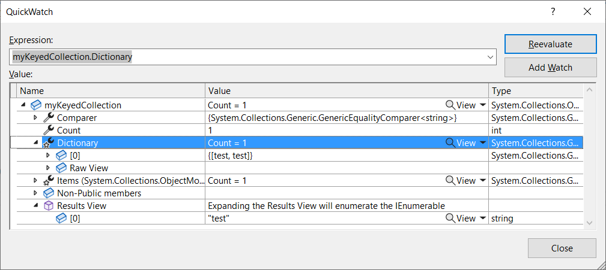

## Preface

Collections in C# are really quite useful when used correctly, but they tend to be used far less often than lists despite fulfilling a similar purpose.  There are a lot of versions of a collection in C# and this article aims to display why you should use collections in your code, as well as how to use them. It's also important to understand that by *Collection* I mean, a specific type of object, rather than the System.Collection namespace or a "collection" which can include essentially anything that can be described as "a collection of objects".  I've also included a few of the less common objects in C# that are called a `collection` in the name of the class.

## What is a collection?

It's really quite straightforward, in that a collection is a list of things and most of them implement IList.  However, there are some nuances in this.  For example, methods in a collection are marked as virtual, meaning they can be overridden for custom implementations.  What this means is that additional functionality (or custom handling) is much easier to add to a collection over a list.  On the other hand, lists have more functionality related to sorting and searching for data.  What this all adds up to, is that if you think you may require a custom implementation of a list (for example, to fire events when items are added), use a collection.  In fact, it's generally recommended providing *collections* to users rather than lists, but in reality this rarely happens as lists work in 99.99% of use cases.  Also, in my experience it's far more likely to need sort and search functionality than any other operation.

## Types of collection

Once again, I'm going to go through some collection types in C# as well as the differences between them.

### Collection

This is the "default" class for a collection. MSDN does [describe this as a "base class"](https://learn.microsoft.com/en-us/dotnet/api/system.collections.objectmodel.collection-1?view=net-7.0) but it's not an abstract class and should not be confused for `CollectionBase`.

This collection can be declared in a very similar fashion to a list:

```csharp
Collection<string> myCollection = new Collection<string>();
```

Adding, removing and inserting data in a collection is quite straightforward:

```csharp
myCollection.Add("item 1");
myCollection.Insert(1, "item 2");

myCollection.RemoveAt(1);
myCollection.Remove("item 1");

myCollection.Clear();
```

While finding data in a collection isn't as extensive as a list, there's still a lot of ways you can find data in a collection:

```csharp
// index based
string itemOne = myCollection[0];
string itemTwo = myCollection.ElementAt(1);
IEnumerable<string> firstTwo =  myCollection.Take(2);
IEnumerable<string> lastTwo = myCollection.TakeLast(2);

// item based
string anotherItemTwo = myCollection.First(i => i == "item 2");
string? nullItem = myCollection.FirstOrDefault(i => i == "not in the list");
IEnumerable<string> items = myCollection.Where(x => x == "item 1");
IEnumerable<string> amotherMultipleitems = myCollection.TakeWhile(x => x == "item 1");
IEnumerable<string> anotherItemList = myCollection.Intersect(new List<string>() { "item 2" });

// returning indexes
int index = myCollection.IndexOf("item 1");


// boolean based
myCollection.Contains("item 1");
bool isEqualTo = myCollection[1] == "item 2";
```

While there aren't any methods to *sort* the collection, there are functions that can be used to order the collection:

```csharp
IOrderedEnumerable<string> orderedEnumerable = myCollection.OrderByDescending(x => x == "item 2"); // item 2, item 1
IOrderedEnumerable<string> orderedEnumerableTwo = myCollection.OrderBy(x => x == "item 1"); // item 2, item 1
```

Finally, collections provide a lot of functions to cast to other object types.  For example, the classic `ToList()`,`ToString()` and `ToArray()` but also to various specialized objects, such as `ToSortedSet()`.

The Collection class lives in the `System.Collections.ObjectModel` namespace.

### Keyed Collection

Frankly a keyed collection should probably be discussed in my [article about dictionaries](https://dev.to/jlewis92/a-quick-tour-of-dictionaries-in-c-gg9) as they are pretty closely related.  There are some differences though.  For example, a keyed collection guarantees *order* whereas a Dictionary does not.  Additionally, a keyed collection is actually an abstract class, meaning that it needs to be inherited from to work:

```csharp
// This is a pretty useless class as it just sets the key to the value.
public class ConcreteKeyedCollection : KeyedCollection<string, string>
{
    protected override string GetKeyForItem(string item)
    {
        return item;
    }
}
```

Once this done, you can declare a keyed list like this:

```csharp
KeyedCollection<string, string> myKeyedCollection = new ConcreteKeyedCollection();
```

While I did say this acts like a dictionary internally, you still add items without a key and then this key is set based on the data in the abstract class:

```csharp
myKeyedCollection.Add("test");
```

What's interesting about the keyed collection, is that it contains both a collection *and* a dictionary.  This means you have access to data retrieval in both the fashion listed above and methods found on dictionaries, like `TryGetValue()`.  This can be seen when we take a look at the QuickWatch window:



Obviously, this does mean you get a slight performance hit compared to just using a straight dictionary (as you're maintaining a list as well), there is also the increased code complexity due to having to create concrete implementation of the class. Therefore, unless you specifically *need* an ordered dictionary, I would just stick with an ordinary dictionary.

The keyed collection abstract class lives in the `System.Collections.ObjectModel` namespace.

### Observable Collection

While the collection might be the "default" class, the one I most often see used, is the observable collection. This is especially true within C# GUI programs such as WPF.  The reason for this, is that when items are added to this type of collection, an event is fired.  This makes it extremely useful for two-way data binding as compared to a list, which does not tell an observer when the collection has changed.

Observable collections can be declared like this:

```csharp
ObservableCollection<string> myObservableCollection = new ObservableCollection<string>();
```

As I mentioned above, the main difference between a standard collection and an observable collection, is an event called `CollectionChanged` which can be used in the same way as a standard event:

```csharp
public void SomeMethod()
{
    myObservableCollection.CollectionChanged += OnCollectionChanged;
}

private void OnCollectionChanged(object sender, NotifyCollectionChangedEventArgs e)
{
    throw new NotImplementedException();
}
```

The observable collection class can also be found in the `System.Collections.ObjectModel` namespace.

### Read Only Collection

As in my articles on dictionaries and lists, a read only collection is used when you don't want a user to be able to modify a collection after initialization.  Unlike lists and dictionaries though, a read-only collection is *not* an interface and is instead a concrete implementation:

```csharp
List<string> myStringList = new List<string>()
{
    "item 1",
    "item 2"
};

ReadOnlyCollection<string> myReadOnlyCollection = new ReadOnlyCollection<string>(myStringList);
```

Finally, the read-only collection class can also be found in the `System.Collections.ObjectModel` namespace.

### Blocking Collection

Within collections, this is the thread-safe version.  It's essentially a C# implementation of the [producer-consumer pattern](https://jenkov.com/tutorials/java-concurrency/producer-consumer.html).  In addition to blocking, there is also bounding functionality, where you can set the maximum size of the collection:

```csharp
BlockingCollection<string> myBlockingCollection = new BlockingCollection<string>();

// only allows 2 items before being blocked
BlockingCollection<string> myBoundedBlockingCollection = new BlockingCollection<string>(2);
```

you can add and remove items in a few different ways that are different from standard:

```csharp
myBoundedBlockingCollection.Add("item 1");
myBoundedBlockingCollection.Add("item 2");
myBoundedBlockingCollection.Add("item 3"); // this will block the thread until an item is removed
myBoundedBlockingCollection.TryAdd("item 3"); // this continues execution even if bounded

// removing items
myBoundedBlockingCollection.Take(); // this is FIFO and has several overloads
myBoundedBlockingCollection.Take();
myBoundedBlockingCollection.Take(); // blocks the thread until something added
myBoundedBlockingCollection.TryTake(out string? item, TimeSpan.FromSeconds(1)); // the second parameter is a blocking timeout for if the collection is empty
```

Most notably, addition/removal operations accept cancellation tokens for additional use under threaded workloads.

In addition to this, blocking collections provide a few additional properties:

```csharp
int capacity = myBoundedBlockingCollection.BoundedCapacity; // this would be 2

bool addingCompleted = myBoundedBlockingCollection.IsAddingCompleted;  // false
myBoundedBlockingCollection.CompleteAdding();
bool addingCompletedAfterCompleteAdding = myBoundedBlockingCollection.IsAddingCompleted; // true

bool fullyCompleted = myBoundedBlockingCollection.IsCompleted; // only true when `CompleteAdding` has been called and the collection is empty
```

Finally, if you're working with *multiple* blocking collections in multithreaded workflow, the class itself has some static methods that can be helpful:

```csharp
List<BlockingCollection<string>> myBlockingCollectionList = new List<BlockingCollection<string>>()
{
    myBlockingCollection,
    myBoundedBlockingCollection
};

// just picks one of the blocking collections to add/remove the item
BlockingCollection<string>.AddToAny(myBlockingCollectionList.ToArray(), "an item");
BlockingCollection<string>.TakeFromAny(myBlockingCollectionList.ToArray(), out string? item);

// there are also `Try` versions of both these methods
```

The blocking collection lives in the `System.Collections.Concurrent` namespace

### Name Value Collection

The name value collection doesn't work the same way as the other collections in this article and is more like a combination of a dictionary, collection and tuple.  It's primarily used for holding things like headers for web requests.  Additionally, a name value collection only accepts strings.

It can be declared like the following:

```csharp
NameValueCollection myNameValueCollection = new NameValueCollection();
```

Moreover, what makes the name value collection different from a dictionary, is that the keys do not have to be unique.  The best way I've found to think about this, is that while addition works by adding a single string to both the key and value, internally it adds the value to an array:

```csharp
myNameValueCollection.Add("item 1", "item 1");
myNameValueCollection.Add("item 2", "item 2");
myNameValueCollection.Add("item 1", "item 3");

string[]? strings = myNameValueCollection.GetValues(0); // contains "item 1" and "item 3"
string? commaSeparated = myNameValueCollection["item 1"]; // interestingly, this returns a comma separated list of values
```

The name value collection lives in the `System.Collections.Specialized` namespace

### Visual Basic Collection

Generally I'd consider this collection a forerunner to the collection and dictionary in C# that has been carried forward (I'm pretty sure it came from Visual Basic). It can be constructed like the following, of which I've included the namespace to avoid confusion with the collection referenced above:

```csharp
Microsoft.VisualBasic.Collection myVisualBasicCollection = new Microsoft.VisualBasic.Collection();
```

I wouldn't recommend this collection in ~~modern~~ C# at all, because it's a holdover from Visual Basic, and it's not generic, but instead uses `object`.  This means it's not type-safe.  For example this is perfectly valid:

```csharp
myVisualBasicCollection.Add("1");
myVisualBasicCollection.Add(1);
```

Also, this is technically a key-value collection where you can choose not to add a key.  This is another reason I would not to use this, but you can add a key in the following way:

```csharp
myVisualBasicCollection.Add("value", "key");
```

Given this is a much older class, there is also a lot fewer methods that can be used to interact with objects held within one.

As mentioned above, this collection can be found in the `Microsoft.VisualBasic` namespace.
