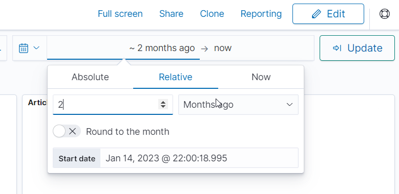

## Background

So I was doing some looking through some of the bits and pieces you can get access to within your DEV account and I notices there was a rather interesting tab in my dashboard for analytics.  While I'm not a data scientist by any stretch of the imagination, it still pretty cool to see how you're doing in DEV.to.  So taking a look, there's some pretty cool features showing things like readers, new followers and reactions. For reference, this is what mine looks like as I'm writing this article:


You can *also* get similar data out of an individual article.

From looking at this I can see that I clearly did well at the beginning this month and it's tapered off pretty quickly (maybe need to look in to writing something a bit more popular?).  I can see as well, that I've got 2 spikes in my reader graph that are related to an article I wrote around [my setup for posting to DEV.to](https://dev.to/jlewis92/my-setup-for-publishing-to-devto-using-github-1k0n) and also [how to convert your local git repository to another remote programmatically](https://dev.to/jlewis92/how-to-programmatically-convert-desktop-git-repositories-to-a-new-remote-repository-1082).  Interestingly, my second popular article didn't have any corresponding engagement in DEV.to, which means that it was probably popular via another website, rather than directly from DEV.to.  Looking at the traffic summary for that second article, I can see this is true and that it's most popular on twitter for some reason?


Anyway, getting a bit off track here, but after the first few minutes of looking at the analytics you can get out, there really isn't *that* much information I can get out, and it's also pretty general i.e.: some of the things I'm interested in finding out are probably pretty niche.  So I spent some time thinking of if there was a way I could get some more information out that I wanted to know.  Turns out, there is!

## Forem API

The first step to figuring out if there's anything I can do to get more information, is to find out if there are any data sources that are accessible to me as a user.  Fortunately for me, DEV is built on an open source software platform known as Forem.  Luckily for me, it seems like somebody has *also* wanted to be able to programmatically grab data out of DEV and there's [already an API that I can use to grab data from](https://developers.forem.com/api).  Being honest, if this wasn't here I likely would have stopped at this point, as while it would be possible to scrape data directly from the DEV, it would have been a pain that I didn't want to to deal with so this API makes everything possible.

While the API itself is incredibly useful, while writing this article there is currently 2 versions of the API which contain different endpoints:


This basically means I'm going to have to do some extra work later as both version contain useful stuff and I currently can't use the v1 API for everything.  However, as I'll talk about later I've got some ways to make this *really* easy to implement later.

## OpenSearch

Now I know I've got some data I could use, I now need to find a platform that I can use to analyse the data coming from the Forem API.   I did consider some other pieces of software, such as [Google BigQuery](https://cloud.google.com/bigquery) (with looker studio) and [ElasticSearch](https://www.elastic.co/) (with Kibana), I ultimately went with [OpenSearch](https://opensearch.org/) which is essentially a forked version of ElasticSearch maintained by AWS.  The main reasons are that I could host it locally for free (unlike BigQuery).  I do have some prior experience with both elastic (back when it was called ELK) and OpenSearch, but my work with OpenSearch was far more recent, so I decided to go with that.

OpenSearch also provides code libraries that allow you to directly interact with the OpenSearch database from code, which given I'm writing something new that's specifically supposed to interact with just OpenSearch and an API, makes it a much more straightforward to implement.  This is instead of going down the more 'traditional' route of analysing log files (which is the 'L' in ELK).

OpenSearch really consists of 2 parts, the NoSQL database OpenSearch, and the data visualisation tool known as OpenSearch Dashboard.  As a NoSQL database, OpenSearch doesn't really have the concept of "tables" but uses indexes instead, which work pretty similarly.  As with a fair number of other NoSQL databases, the schema for the data is figured out based on the data itself, rather than setup beforehand.  This does mean you can get into a mess if your data doesn't use standard data formats.  Fortunately, as Forem is using OpenAPI, this shouldn't be an issue.

### Installation

OpenSearch has an AWS managed service (of course) but the way I use it is via docker.  If you're using windows (like me) you can use [Docker Desktop](https://www.docker.com/products/docker-desktop/) to run the containers.  OpenSearch provides 3 different ways to run the docker container, these are running a single node via docker and a pair of docker-compose files.  I decided not to run in single node mode as I also wanted to run OpenSearch dashboard, which both docker-compose files allow you to do automatically.  In terms of the docker compose versions, there is a production version and a dev version, the difference being that the dev version has the security plugin disabled.  Given I'm just running locally and the security plugin takes some extra setup, I just went with the dev docker-compose file.

The compose itself, will create a pair of OpenSearch nodes in a cluster and a OpenSearch dashboard instance to view the data:

```docker
version: '3'
services:
  opensearch-node1:
    image: opensearchproject/opensearch:latest
    container_name: opensearch-node1
    environment:
      - cluster.name=opensearch-cluster # Name the cluster
      - node.name=opensearch-node1 # Name the node that will run in this container
      - discovery.seed_hosts=opensearch-node1,opensearch-node2 # Nodes to look for when discovering the cluster
      - cluster.initial_cluster_manager_nodes=opensearch-node1,opensearch-node2 # Nodes eligibile to serve as cluster manager
      - bootstrap.memory_lock=true # Disable JVM heap memory swapping
      - "OPENSEARCH_JAVA_OPTS=-Xms512m -Xmx512m" # Set min and max JVM heap sizes to at least 50% of system RAM
      - "DISABLE_INSTALL_DEMO_CONFIG=true" # Prevents execution of bundled demo script which installs demo certificates and security configurations to OpenSearch
      - "DISABLE_SECURITY_PLUGIN=true" # Disables security plugin
    ulimits:
      memlock:
        soft: -1 # Set memlock to unlimited (no soft or hard limit)
        hard: -1
      nofile:
        soft: 65536 # Maximum number of open files for the opensearch user - set to at least 65536
        hard: 65536
    volumes:
      - opensearch-data1:/usr/share/opensearch/data # Creates volume called opensearch-data1 and mounts it to the container
    ports:
      - 9200:9200 # REST API
      - 9600:9600 # Performance Analyzer
    networks:
      - opensearch-net # All of the containers will join the same Docker bridge network
  opensearch-node2:
    image: opensearchproject/opensearch:latest
    container_name: opensearch-node2
    environment:
      - cluster.name=opensearch-cluster # Name the cluster
      - node.name=opensearch-node2 # Name the node that will run in this container
      - discovery.seed_hosts=opensearch-node1,opensearch-node2 # Nodes to look for when discovering the cluster
      - cluster.initial_cluster_manager_nodes=opensearch-node1,opensearch-node2 # Nodes eligibile to serve as cluster manager
      - bootstrap.memory_lock=true # Disable JVM heap memory swapping
      - "OPENSEARCH_JAVA_OPTS=-Xms512m -Xmx512m" # Set min and max JVM heap sizes to at least 50% of system RAM
      - "DISABLE_INSTALL_DEMO_CONFIG=true" # Prevents execution of bundled demo script which installs demo certificates and security configurations to OpenSearch
      - "DISABLE_SECURITY_PLUGIN=true" # Disables security plugin
    ulimits:
      memlock:
        soft: -1 # Set memlock to unlimited (no soft or hard limit)
        hard: -1
      nofile:
        soft: 65536 # Maximum number of open files for the opensearch user - set to at least 65536
        hard: 65536
    volumes:
      - opensearch-data2:/usr/share/opensearch/data # Creates volume called opensearch-data2 and mounts it to the container
    networks:
      - opensearch-net # All of the containers will join the same Docker bridge network
  opensearch-dashboards:
    image: opensearchproject/opensearch-dashboards:latest
    container_name: opensearch-dashboards
    ports:
      - 5601:5601 # Map host port 5601 to container port 5601
    expose:
      - "5601" # Expose port 5601 for web access to OpenSearch Dashboards
    environment:
      - 'OPENSEARCH_HOSTS=["http://opensearch-node1:9200","http://opensearch-node2:9200"]'
      - "DISABLE_SECURITY_DASHBOARDS_PLUGIN=true" # disables security dashboards plugin in OpenSearch Dashboards
    networks:
      - opensearch-net

volumes:
  opensearch-data1:
  opensearch-data2:

networks:
  opensearch-net:
```

***NOTE:*** As I said earlier, this is NOT a production setup, this is a dev setup compose file, so should not be used outside a dev environment as you need the extra security.

If this is the first time you've run a OpenSearch cluster in Docker Desktop you might notice that the containers crash out and complain about something like `vm.max_map_count is less than 262144`.  This is because the cluster needs more resources than the Docker receives by default.  While you *can* just write into the WSL subsystem to fix it each time, I like to setup the config file so I don't get annoyed by having to do some command line setup after every restart.   In order to fix this, you need to create a file in `C:\Users\<user running docker>` called `.wslconfig`.  The full file path would be something like `C:\Users\jack.lewis\.wslconfig` and then you then need to add the following to this file:

```ini
[wsl2]
memory=4GB      # up's the memory from 2GB to 4GB
processors=4    # up's the number of processors to 4
kernelCommandLine="sysctl.vm.max_map_count=262144"   # up's the max map count to the minimum required by OpenSearch
```

At this point, if you used the config I linked above, the containers should start and look like the following:


From this, what you need to know is that `http://localhost:9200` is the address you need to use to push data into OpenSearch and `http://localhost:5601` can be opened in the browser to look at OpenSearch dashboard.

If you just want to explore some of the things OpenSearch can do, at this point you can open up dashboard, press the home button on the left hand side, press `add sample data` and it should give you a choice tp add some sample data to play around with:


## Finding data to analyse

Immediately, I was *very* happy to note that Forem provides an [OpenAPI spec document](https://swagger.io/specification/) for both versions of the API, which is going to make it really easy to explore.

All you need to do is download the spec, and then drag the file into [Postman](https://www.postman.com/) and you instantly have a quick way to explore all the endpoints in the Forem API:


**NOTE:** if you want to actually return data, you need to set an API key at the top level folder (where it says DEV API (beta) for V0 and Forem API V1 for V1) and it's under variables.  You can get the DEV API key from [here](https://dev.to/settings/extensions) and going to the point where it talks about DEV Community API Keys.

I *think* I might have also had to change the V1 base URL from `https://dev.to/api` to `https://dev.to`.

I think I really need to say though that the most common work I do day to day is building and integrating with API's.  From this I know how *difficult* it is to get an OpenAPI spec right, and while the one from Forem *does* have some minor issues, on the whole I've had to do less messing around with it than pretty anything else I've integrated previously - which is great!

At this point, I can start exploring for data that would be useful and when I'm looking to integrate something into OpenSearch, I'm looking for 2 things:

1. WHAT happened
2. WHEN it happened

These, to me are the most important thing as OpenSearch is a time based analytics dashboard (when it happened) and the most common thing I really do in it is count how often something occurs (what happened).

From this, I'm drawn to the [user's published articles](https://developers.forem.com/api/v1#tag/articles) endpoint in V1 and the [followers](https://developers.forem.com/api/v0#tag/followers) endpoint in V0.  There's a lot more than this which could be useful, but at this point I'm pretty much just building a proof of concept, so these were the 2 endpoints I found that were most immediately useful to me (and honestly, the easiest to try and pull some useful stuff out of).

## Integration

At this point, I now need to glue everything together.  To do this, I need a program which can pull down data from Forem and then push it into the OpenSearch cluster.

If you just want to take a look at the final solution, it lives here:

<!-- markdownlint-disable no-bare-urls -->
<!--  -->
<!-- markdownlint-enable no-bare-urls -->

### Programming language choice

It really wasn't much of a choice in this case as C# is my main language and I do enjoy working with it. Additionally, while .Net 7 is out, after [being burnt by .Net Core 3.0 announcing end-of-life a few days before it happened](https://devblogs.microsoft.com/dotnet/net-core-3-0-end-of-life/), I pretty much always work with the long term support version if I can help it, so I went with .Net 6.

### Forem integration

While I could have written out a full API to talk to the Forem API, this would have taken a long time and I had an OpenAPI spec document, so I used [OpenAPI Generator](https://openapi-generator.tech/) which can pretty much instantly generate a full API integration, just from the OpenAPI spec.  While I'm using C# and .Net 6, this tool has [a pretty large list of supported languages](https://openapi-generator.tech/docs/generators/), so if you wanted to code something similar, you could absolutely use your language of choice, rather than C#.

while there's a lot of different ways to install OpenAPI Generator, the easiest is probably NPM, where you just need to use the command `npm install  @openapitools/openapi-generator-cli -g` and you should be able to start using the generator.

For me, all I needed to do was run the generator twice, once for V0 and again for V1 using the following command:

```powershell
 openapi-generator-cli generate -i <location of the OpenAPI file on disc> -g csharp-netcore -o <output location> --additional-properties=targetFramework=net6.0,apiName=ForemVersion<Zero or One>,packageName=ForemVersion<Zero or One>
```

breaking this down:

```powershell
 openapi-generator-cli generate # generate an API
 -i # The location of the Forem API OpenAPI yaml
 -g csharp-netcore # The name of the generator - .net 5+ lives in this one as well
 -o # where you want to save the output
  --additional-properties= # properties that are generator specific
  targetFramework=net6.0, # This where I set .Net 6
  apiName=ForemVersion<Zero or One> # This is the name of the default class generated by the API - it would normally be DefaultAPI
  ,packageName=ForemVersion<Zero or One> #  This is the name of the C# project that will be generated
```

After you run this command, go to the output directory, then into src and you should see 2 C# projects:


As you can see, it generates 2 C# projects that you can import into a C# solution.  Rather helpfully, the generator *also* generates a load of tests for the generated code.  All I needed to do at this point, was import the generated projects into my own via the solution explorer in Visual Studio and I had a ready built integration into Forem:


For those who use C#, the generator uses the RestSharp library by default, as opposed to HttpClient, but it's possible to change this if you really want to.

There was some bits and pieces I *did* need to update in the integration though, zas building code this way will do *exactly* what swagger definition tells it to do, for example, if a value on a Request or Response is set as *Required* and you either don't set the value, or the value comes back as null, the API wi ll throw an error.  When I was doing this, there were a few values in the Articles Response that are marked as required, but I didn't get them back, so did need to modify the generated code very slightly to remove the IsRequired attribute from a few Articles model.

### OpenSearch integration

***Note:*** The next few bits are heavily C# based, so if you're not that interested in C# you can probably skip to the point where I start talking about OpenSearch again.

While ElasticSearch was originally built to ingest log files, you can also use a package to directly integrate OpenSearch into the code itself, which is what I did with this project.  If you're interested in trying this out, you can find a list of supported clients [here](https://opensearch.org/docs/latest/clients/index/).

Integrating OpenSearch into an object oriented language is extremely simple because all you need to do is pass the objects you want to index into OpenSearch, and then the rest is pretty much handled for you.  For reference, here is pretty much all of the code I use to push articles into OpenSearch (after setup):

```csharp
/// <summary>
/// Indexes articles into OpenSearch
/// </summary>
/// <param name="articles">The articles to index</param>
/// <returns>A response based on whether the upload succeeded</returns>
public async Task<BulkResponse> IndexArticleData(List<ForemVersionOne.Model.ArticleIndex> articles)
{
    var response = await _openSearchClient.IndexManyAsync(articles, "articles");

    return response;
}
```

While I could spend some time throwing some additional error handling etc.  This code is proof of concept so I'm not too bothered.  It should should also be noted, that the object I'm passing in to this method is taken from the generated API code discussed above.

Breaking down what I'm doing in OpenSearch is as follows:

```csharp
await // I'm using async methods to push the data
_openSearchClient // calling an OpenSearch client I setup in this class
.IndexManyAsync // I'm using index many, inbstead of index as I just want to push in a load of articles, then forget about it
(articles, // The list of articles I want to push into OpenSearch
"articles"); // The index in OpenSearch I'm pushing the data to
```

Re-indexing articles that I've previously indexed does not cause a new version of the article to be indexed, but does update the old article.  While I've not dug into the OpenSearch code, I'm assuming this means there's something which is tracking identifiers attached to the data being pushed in (like this endpoint does have).

### Pulling everything together

Now I've got code that can handle both pulling data down from Forem and then taking that data and pushing it into OpenSearch, I now just need to pull everything together and provide an interface that is easy to use.

For pulling everything together, it's not that special, I'm just using a standard C# library project that takes in an AppSettings object for settings.  I did decide that I wanted the ability to toggle the collection of data from each endpoint so I did split out the code along these lines.  Also, given the data is paginated, I do loop through until I can get all the data for use.  I understand this is not the most "efficient" method of doing this as I'm retrieving data I've previously indexed but that might be something I look at in the future.  If you're interested, the code for how this looks, the articles endpoint is here:

<!-- markdownlint-disable no-bare-urls -->
<!--  -->
<!-- markdownlint-disable no-bare-urls -->

### Settings

In terms of access, I decided the easiest thing to do was to create a console app project that can link into the analytics library easily and be very flexible. For example, as it's just an executable it can be run directly, via a service or via scheduled task with minimal setup.  This is all facilitated via a timer event being fired off after a set amount of time (default to once a day) so that you don't need to keep running the data collection task.  I also added the ability to run as a linux docker container because Visual Studio makes this only a couple of button presses to add:


In order to work, the application does need some settings passed in, most notably there is an AppSettings file built into the project.  This controls settings for the ForemGatherer library itself and by default looks like this:

```json
{
  "AppSettings": {
    "BasePath": "https://dev.to",
    "NodeList": [
      "http://localhost:9200/"
    ],
    "ApiKey": "" // While the API key can be set in this file, I don't reccomend it
  }
}
```

The project is setup to pull settings into this file via several methods:

- directly into the file - support is also there for using `NETCORE_ENVIRONMENT` i.e.: `appsettings.dev.json`
- environment variables
- [user secrets](https://dotnetcoretutorials.com/2022/04/28/using-user-secrets-configuration-in-net/)
- command line arguments
  - These override all other methods

The command line arguments supported are as follows:

```powershell
  -a, --articleGatherer     (Default: true) Whether the article gatherer is enabled

  -f, --followerGatherer    (Default: true) Whether the follower gatherer is enabled

  -f, --GatherData          (Default: once per day) How often to gather data in TimeSpan format

  -k, --ApiKey              The API key used to connect to the Forem API

  -n, --NodeList            A list of opensearch nodes

  -b, --BasePath            (Default: https://dev.to) The base path of the Forem site

  --help                    Display this help screen.

  --version                 Display version information.
```

As I said, I can also run this as a Docker container and I've got some vague ideas to link it into a docker compose so that I can run everything together:


All you need to do is run the code and verify that you're getting some data in OpenSearch. You can do this by going to the following address in a web browser `http://localhost:9200/_cat/indices?v` and you should see something like the following:

```text
health status index                           uuid                   pri rep docs.count docs.deleted store.size pri.store.size
green  open   .opensearch-observability       fnli1mGtSJCzRUsMXXQJYg   1   1          0            0       416b           208b
green  open   followers                       2bSUsOgGSBOi3rJyuq3NPw   1   1         52            0     73.6kb         36.8kb
green  open   .opendistro-reports-definitions SqwXfm_BRMmyTk305ktGaQ   1   1          0            0       416b           208b
green  open   articles                        2LNsx-bOS6GizJvoyRAfLQ   1   1          8            0    112.8kb         56.4kb
green  open   .opendistro-reports-instances   40Wf6ofGStSqqJW7Z3-jew   1   1          0            0       416b           208b
green  open   .kibana_1                       bc9P7hL8SJ68jDutyPajFg   1   1         23            9     95.4kb         47.7kb
```

## OpenSearch Dashboards

Once in OpenSearch, I need to add the data to the dashboard from OpenSearch.  To do this, open the hamburger menu to the left and go to Management > Stack Management > Index Patterns and this should give you the following page:


Index Patterns are used to tell OpenSearch Dashboard what data you're going to use.  These can incorporate as many or as few indexes as you want, but given you also need to set a time field, which is different between Followers and Articles, which meant I just created 2 index patterns.  For articles, you do get a few choices on the next screen, which is setting a time field, but I'm most interested in published articles, so that's what I chose.  This has the knock on impact of essentially removing my draft articles, which is also what I wanted to do.

Now I've got data into the OpenSearch Dashboard, I need to analyse the data. To start with, I used the Discover tool to see if there was interesting, which I did find pretty quickly, such as DEV using [Cloudinary](https://cloudinary.com/) for image storage and that I've been fairly consistent in releasing articles:


One of the nicest things about OpenSearch is that I can set how long the data range I want to view is:



This is pretty helpful, as it let's me set the exact length of time I'm interested in, as opposed to the stats page, where the only option after monthly is infinite which is pretty difficult to see what's going on, each day as I've now been on the sight (slightly) more than a month.

I'm not going to go through how I made every individual visualisation, but if you're interested I've dropped a copy of the dashboard I built in the [repository for this project](https://github.com/jlewis92/ForemAnalyticsGatherer/tree/main/OpenSearch%20dashboard). Here's some pictures that I've taken of the dashboard:


It definitely bears repeating, I'm not a data scientist, so I'm sure you could figure out some better things to look at (as well as not constantly changing case in the names of the visualisations).  I do think this does give a pretty good idea of the things I can gather for helping me see how I'm doing on DEV.

## Next steps

It's pretty clear the API is still heavily under development by the Forem team, evidenced by the "Tags" endpoint disappearing while I was writing this article (to be fair it wasn't THAT useful anyway) and that there's a [fairly new pull request for removing V0 endpoints](https://github.com/forem/forem/pull/19062) I think it's likely that access to the OpenAPI docs (and followers and articles) will stay around.  I'm thinking I could pull out some more data based around the endpoints I do have, but I do need to do some thinking about.  Also, given the API is under active development, and there's a fair amount of data DEV has access to in the analytics console that I don't have access to via the API, it would be nice to extend my dashboard to include this if it does get updated.
