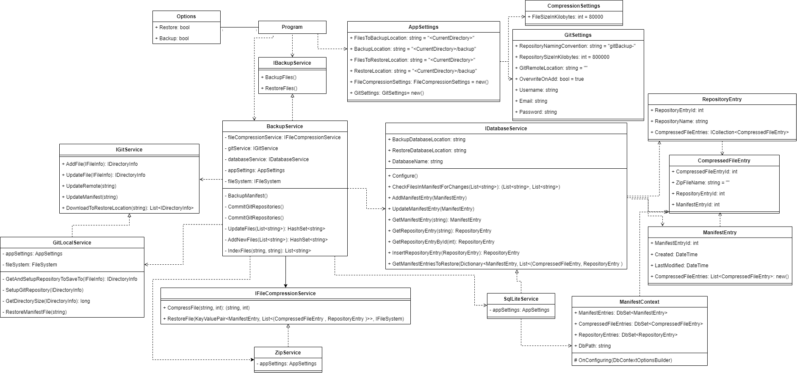

***NOTE:*** this code, while working, is very much proof of concept and as such has lots of bugs.  I'm also not planning to fix these as this is a pretty stupid idea. However, I thought it was interesting enough to share.

## Background

This whole thing came about from a few realizations:

- GitHub allows a maximum of 100MB per file before they block you
- Based on [this](https://stackoverflow.com/questions/38768454/repository-size-limits-for-github-com) answer from Stack Overflow, the "hard limit" for the size of a repository in GitHub is 100GB, but really should be kept under 5GB (and preferably 1GB) - it's a little difficult to find information on this though
- GitHub lets you have an unlimited number of repositories
- There's an endpoint that lets you set up a GitHub repository programmatically
- zip and tar files both have the ability to easily be split apart

So, pretty much from all of this, can I build something that can I take in a large file, split it apart into manageable chunks, upload it via Git and then reassemble everything when I need to restore from backup?

### You talk about GitHub, why are you using Git?

This comes down to the simple premise that GitHub would probably not be too happy with me trying this, so better not to do it at all after I've got some preliminary research done.

## TL;DR - it works

Repository here:

<!-- markdownlint-disable-next-line -->


Video in action here:

<!-- markdownlint-disable-next-line -->


## Why?

Honestly, it seemed like a fun challenge and that's pretty much it.  Really, this is a terrible idea to choose a backup strategy.  It's incredibly slow (that video above is over 1 minute of waiting for files transfer *locally*) and git is absolutely not built to do this as git works by analysing differences in files and saving them.  If you're using binaries (such as zip files) this means that git has to store a stupid amount of extra data to make it work.  Additionally, because of how I wrote this software, you could have up to *4* copies of the same data on disk at the same time, which is pretty terrible.  Although, while useless it was still a pretty neat project to work on.

## Tooling choice

I'm primarily a C# developer, so I'm going to use C# and given I'm going to be interacting with the Git CLI, the easiest project to choose is a console application.  Additionally, I decided to go with zip over TAR as I'm using windows. I'll also need a database to store where the files live in GitHub and given I'm already storing everything in files, and need to move them around, a file based database was my best option, and from these SQLite before, so this was my tool of choice.

## Flowcharts

At this point I needed to visualize the flow of the application in my head.  I decided I needed 2 commands to start with, `backup` and `restore`.  Given there's a fair amount of complexity on how exactly each command will work, here are some flowcharts explaining it:

### Backup

<!-- markdownlint-disable-next-line -->


### Restore

<!-- markdownlint-disable-next-line -->


## Database Structure

As I said, I needed a simple database to keep track of where everything lives within the repositories and because I'm going to want to back that file up, the best choice for me was to use SQLite.  I decided to go with 3 tables:

**Manifest Entries:** holds details related to each file.
**Repository Entries:** holds details related to each repository being tracked
**Compressed File Entries:** holds details related to compressed file, as well as the manifest entry and repository entry that is attached to the compressed file.

This fits together something like this:

<!-- markdownlint-disable-next-line -->


## Code Structure

I depended heavily on interfaces to build up this code base.  It's probably simplest to just show off the class diagram for this code below.  If you're interested in exploring the code itself, it's linked above.



### Packages

Within the code itself, I made use of a few packages to make life easier on myself.  The main ones chosen are listed here:

- CommandLineParser
  - Creates better syntax structures for command line arguments, such as -b for --backup
- DotNetZip
  - Popular library for working with zip files in .Net
  - This library was chosen as it has support for splitting files
- LibGit2Sharp
  - It's a library for working with Git in C#
- Entity Framework Core
  - Common C# ORM used to link objects in code to the SQLite database
  - One of the nice things about this implementation, is that I can call EnsureCreated() to create a database if it doesn't already exist
- Serilog
  - Excellent logging tool
- TestableIO.System.IO.Abstractions
  - This library creates abstract version of System.IO which makes them far more testable

### Challenges

There were a few issues I did run into when building this code out - thought I'd throw these out there in case anybody runs into something similar

#### Working with filesystems

I had to work *heavily* with the file system on this project.  Everything from the zip library outputting directly into files, to moving things around for the git repositories.  While the code itself doesn't do anything fancy, System.IO is pretty untestable in C# and I wanted to write some tests for this.  As a result, I needed some way to test the file system.  I settled on using the TestableIO library mentioned above which allows you to use dependency injection on an interface class, rather than writing my own wrapper.

#### SQLite Write-Ahead Logging

If you're not sure what write-ahead logging is, there's a full explanation [here](https://www.sqlite.org/wal.html).  Essentially, it's a way of implementing ATOMIC rollback in SQLite. However, how this works is that new commits to the database are held in a separate file, and then occasionally added back to the database in a process known as "checkpointing".  Unfortunately, because I'm moving the database file around shortly after writing, the additional time taken waiting for checkpointing to occur meant that I'd be uploading a version of the database that doesn't contain the latest changes.  While I did attempt to modify when the checkpointing occurred, I decided to avoid problems entirely and turned this feature off.

### Running the code

GitBackup contains the following commands:

```powershell
-r, --restore    Restore files.

-b, --backup     Backup files.

--help           Display this help screen.

--version        Display version information.
```

In addition to the command line arguments, there is an appSettings.json that can be set in the executable directory to further modify how the program works.  This is what this file looks like with all the defaults:

```json
{
  "AppSettings": {
    "FilesToBackupLocation": "<current folder>",
    "BackupLocation": "<current folder>\\backup",
    "RestoreLocation": "<current folder>\\backup",
    "FilesToRestoreLocation": "<current folder>\\restoreTestFolder",
    "RecursiveFileBackup": false,
    "GitSettings": {
      "RepositoryNamingConvention": "gitBackup-",
      "RepositorySizeInKilobytes": 800000,
      "GitRemoteLocation": "", // this value will need to be set at least
      "OverwriteOnAdd": true,
      "Username": null,
      "Email": null,
      "Password": null
    },
    "FileCompressionSettings": {
      "FileSizeInKilobytes": 80000
    }
  }
}
```

## In the future

So now I've written this and established that it's pretty useless, I'm not likely to come back to this project.  However, if I was, there's a few improvements that could be made quickly.

- Additional logging
  - I've added some, but it pretty poor
- Better error handling
  - this was built quickly and as such error handling is pretty rudimentary
- More tests
  - I've written a few, but I'd need more to write a fully robust test suite
