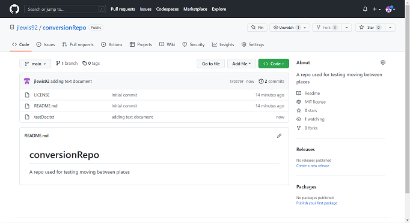
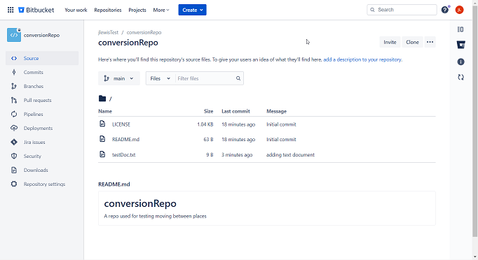
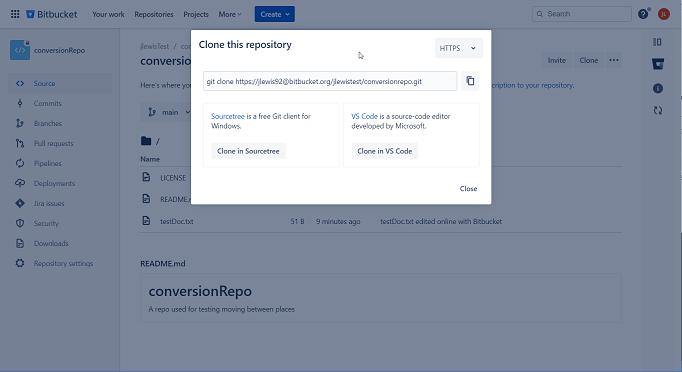
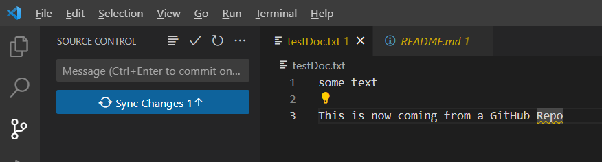
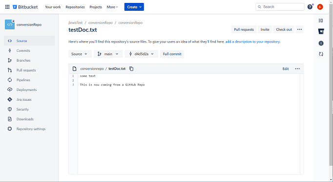

Ever been in the position that your company has decided to change the provider for their git repository? Maybe GitHub isn't offering as a good a deal as BitBucket?  As a software developer this is actually fairly common.  Personally, this has happened to approximately once every couple of years for a variety reasons.  Now, while these git repository providers make it extremely simple to move the repository itself between providers using an import function, actually moving the repository on your machine is left to be figured out by an individual developer.  You can just pull a new copy down of each repository, but this can take time, especially if you have a large number repositories that you've slowly picked up over the years.  Additionally, if you use cloning of the repositories, you can clutter up your file system with multiple versions of the same code. Fortunately, git also offer's tools that make this process a bit simpler.

## Manual process

To start with, just to prove the concept I created a simple repository in GitHub and added a text file to it, just to get some history:



I then just used the BitBucket repository importer to create a BitBucket version:



__*NOTE:*__ it's important that the name of the repository in the workspace is the same between providers

I also left this repository as private, to show the process of moving between private repositories. I also added the line `This is now coming from a BitBucket Repo` to the `testDoc.txt` file to simulate somebody working on the repository between the move.

At this point I just used the command `git config remote.origin.url` to get the current remote URL of the remote repository I want to move, and I got back `https://github.com/jlewis92/conversionRepo.git`.  This makes sense as it's URL I got from when I cloned the repository initially.  All I need to get is the new origin URL from BitBucket:



I just need to run this line to switch the origin to the new repository:

```bash
git config remote.origin.url "https://jlewis92@bitbucket.org/jlewistest/conversionrepo.git"
```

I then verified by running `git config remote.origin.url` again, and I can see that the new remote origin is now `https://jlewis92@bitbucket.org/jlewistest/conversionrepo.git`

I then just ran `git pull` and I instantly got a pop-up asking me to sign in to BitBucket:


Once I logged in on the pull I could see that the file `textDoc.txt` had changed to the following, showing that everything had updated successfully:

```text
some text

This is now coming from a BitBucket Repo
```

If you decide to switch back to GitHub after this, you will see that all the additional pushes to BitBucket are added as commits to the GitHub repository.  I then changed the text to say `This is now coming from a GitHub Repo` in preparation for the next step.

## Automation

Now we've proved we can do this manually, can we automate a script to do this for us?  I think this should be pretty easy, what we need to look at are the remote origin URL and figure out the differences we can use to write a script:

```text
https://github.com/jlewis92/conversionRepo.git - GitHub
https://jlewis92@bitbucket.org/jlewistest/conversionrepo.git - BitBucket
```

We can see that this URL essentially has 2 parts, the base path which won't change between repositories and the end point URL, which will.  This means all we need to do is write a script which can assemble the new URL from the old and attach it to the new base path.  We also need to get the script to work on all repositories in a folder so that we can automate the update process.

I decided to use PowerShell for this as it's the scripting language I know best, but pretty much all scripting languages should work.

This script isn't perfect, but it works for me:

```powershell
Param(
    [Parameter(Mandatory=$true,
    Position=0)]
    $FileLocation,
    [Parameter(Mandatory=$true,
    Position=1)]
    $BasePath
)

# We need git installed, so check it is
try
{
    git | Out-Null
}
catch [System.Management.Automation.CommandNotFoundException]
{
    Write-Output "Git is not installed"
    exit
}

# Convert everything into a valid file path
$FileLocation = Convert-Path $FileLocation

# if the base path doesn't end with / add one
if ($BasePath.SubString($BasePath.Length - 1) -ne "/")
{
    $BasePath = $BasePath + "/"
}

Write-Output "File location is $FileLocation"
Write-Output "Base path is $BasePath"

# Run through all the folders in the directory
foreach($file in Get-ChildItem -Directory $FileLocation)
{
    # Move to the directory and check the remote origin
    Set-Location $file.FullName
    $CurrentRemote = git config remote.origin.url

    # If it doesn't have a remote origin, it's probably not a git repository
    if ($null -ne $CurrentRemote)
    {
        Write-Output "pulling down remote for $file"
        git pull

        # Generate the new URL from the current name
        $End = $currentRemote.split("/")[-1]
        $NewRemote = $BasePath + $End
        Write-Output "converting $file from $CurrentRemote to $NewRemote"

        # Set the new remote origin
        git config remote.origin.url $NewRemote
    }

    #  Move back up a level, in preparation of the next file
    Set-Location ..
}
```

I just saved the script to my desktop under the name `convertGitRemote.ps1` and then ran the code with the following command:

```powershell
.\convertGitRemote.ps1 . "https://jlewis92@bitbucket.org/jlewistest/"
```

After running the script, I got the following output (I did stick a dummy folder in as well, to make sure that wasn't picked up):

```text
PS F:\source\conversionRepo> .\convertGitRemote.ps1 . "https://jlewis92@bitbucket.org/jlewistest/"
File location is F:\source\conversionRepo
Base path is https://jlewis92@bitbucket.org/jlewistest/
pulling down remote for conversionRepo
Already up to date.
converting conversionRepo from https://github.com/jlewis92/conversionRepo.git to https://jlewis92@bitbucket.org/jlewistest/conversionRepo.git
```

I then just ran a git pull on the repository to see if it worked, and as I expected, it was asking me to sync changes from when I moved back:



If I didn't want this change to be added to the repository, I could have reset the HEAD but just to show it's actually updating via my local repository I ended committing the changes:


