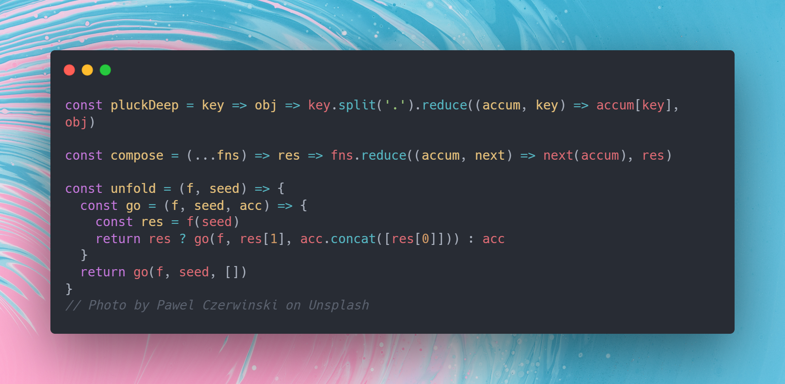

I've written a few articles on DEV now and one of the interesting things you can do on DEV is to use [liquid tags](https://dev.to/p/editor_guide) to embed websites into a post.  There's quite a few of them that are related to programming sandboxes such as [CodePen](https://codepen.io/) which you can use to embed programming directly into an article on DEV.  As I've explained in a [previous article](https://dev.to/jlewis92/tips-and-tricks-on-how-to-keep-motivated-while-writing-code-5h3b) anything which *pushes you to write code* is a great thing to help keep your skills up.  As a result, I quite like the idea of embedding programming into my articles as it's a bit of a sneaky way to push me to write more code. Additionally, having a complete app that you can view and play with is *really* useful for understanding exactly how I did something.

I'm limiting this to JavaScript/TypeScript currently as this is the most common language used to write front ends and therefore has a lot of libraries written with the intention of displaying information visually.  However, if you're learning a specific language, there's usually a liquid tag associated with. For example, C# has liquid tags support for [DotNetFiddle](https://dotnetfiddle.net/).

## [Mermaid.js](https://github.com/mermaid-js/mermaid)

Here's a codepen I've written for a previous [article around estimation](https://dev.to/jlewis92/a-developers-guide-to-estimation-3143):

<!-- markdownlint-disable-next-line -->


This isn't the prettiest example of the kind of output you can get from Mermaid, but it at least shows how you can build a flowchart out using a code based solution.  Flowcharts aren't the only thing you can do with Mermaid and there's a full list in the link above, but you can also write UML like class, state and sequence diagrams and also pie and Gantt charts.  While I've found writing these diagrams does take longer than using something like [draw.io](https://app.diagrams.net/) (which is also written in JavaScript) it does entirely do away with manual formatting of a diagram, which can be the hardest thing to do when writing a diagram.

## [Carbon](https://github.com/carbon-app/carbon)



OK, this isn't a tool to *directly* write code and also is probably a worse option on dev as you can't copy and paste the code directly.  However, for simply showing a beautiful screenshot of code quickly, this is an excellent tool.  Carbon supports a wide variety of languages, can directly pull out an image from [Unsplash](https://unsplash.com/) to use as the background and has direct integration editors, including vscode.  Additionally, Carbon has tools to autoformat code, which is more difficult to do if you're directly writing code into the markdown.

## [Chart.js](https://github.com/chartjs/Chart.js)

Simple chart:

<!-- markdownlint-disable-next-line -->


I think Chart.js is pretty self-explanatory.  It's used to make charts.  The above is a codepen based on the number of referrals I've received for one of my articles.  Just in this simple use case, it's easier to see the relative values of all the different places I'm getting viewers from, which is much easier to understand than the list that the default view gives.

Charts.js is one of many charting libraries on GitHub, but it's currently the most popular with over 60k stars.  It supports 8 different chart types, animations, stacking graphs and as it's JavaScript based, Charts.js can be used to generate charts from code.

## [Two.js](https://github.com/jonobr1/two.js)

<!-- markdownlint-disable-next-line -->


I want to point out, the above CodePen is made by the Two.js team, not me (and it's a lot more impressive than what I could do).  This is a 2D drawing library supporting WebGL, canvas2d and SVG.  Two.js can be used to make interactive code by binding to input devices via JavaScript.  There are a lot of examples of this happening found [here](https://two.js.org/examples/).

## [MathJax](https://github.com/mathjax/MathJax)

<!-- markdownlint-disable-next-line -->


This is another one that might not be that useful as [Katex](https://katex.org/) is supported through liquid tags. You can see an example of this same expression using the liquid tags [here](https://dev.to/jlewis92/a-developers-guide-to-estimation-3143). MathJax is essentially a library to support writing mathematical expressions through code using LaTeX, MathML, and AsciiMath notation, meaning it's a bit more modular than Katex.  Either of these tools will work though.  Additionally, if you're using a CodePen you can set the formatting how you want, rather than relying on the default in DEV.

Simple motion canvas animation:

<!-- markdownlint-disable-next-line -->


MotionCanvas is a way of describing animations via code for use in vide recording.  Granted, the primary use case of MotionCanvas is for video editing software and outputs individual frames rather than a full video and can't be built in a codepen.  However, it's not difficult to use FFmpeg to get a WebM.  There's a full video on how powerful MotionCanvas can be here:

<!-- markdownlint-disable-next-line -->


<!-- markdownlint-disable-next-line -->

If you want to generate a WebM using [FFmpeg](https://ffmpeg.org/), the following command being run from the output directory to do this:

```text
ffmpeg -framerate 60 -i %6d.png -c:v libvpx-vp9 -lossless 1 -pix_fmt yuva420p output.webm
```

<!-- markdownlint-disable-next-line -->


## [Cytoscape.js](https://github.com/cytoscape/cytoscape.js)

CodePen showing things on my desk:

<!-- markdownlint-disable-next-line -->


Cytoscape is another graphing library, but specifically built around networks.  It's pretty straightforward to show complex relationships between objects.  For example, this impressive diagram [showing railways in Tokyo](https://js.cytoscape.org/demos/tokyo-railways/) that also integrates travelling salesmen problem-solving.  Cytoscape is particularly useful as it helps to visualize objects in a [vector database](https://learn.microsoft.com/en-us/semantic-kernel/concepts-ai/vectordb), which given it feels like everything is moving towards AI recently, it's probably nice to know.  The above CodePen also integrates [dagre](https://github.com/dagrejs/dagre) to simplify layout.
