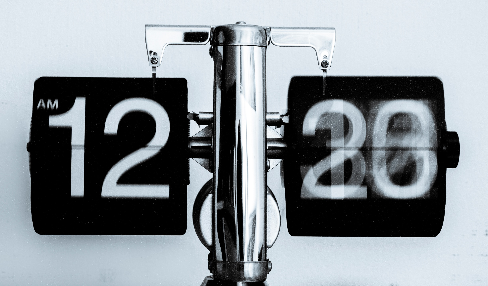

## Preface

I've been programming professionally for nearly a decade now (and casually for a lot longer than that!), and while I'm still learning new things every day, there are certain things I've learnt over the past 10 years that I keep finding have helped me keep writing code and learning new things.  For me, software development is one of those careers where you need to keep learning as what was a great choice even last year, can quickly become a terrible choice today.  As a result, *anything* which pushes me to do some work in my spare time is helpful to me personally and professionally.  Finally, in my experience the best way to learn something is to *use* it as opposed to just reading about it, as it teaches you the pitfalls and idiosyncrasies that online guides can sometimes miss. I should note, that these are things that I've found *help me*, and this isn't an exhaustive list.

### 'Fun' Money

Really, the first few tips come down to equipment choice that I'll discuss later.  However, the thing which I will always advocate is keep a small pot of money every month to the side that will purely go towards something technical.  This doesn't need to be used up every month, or be a large amount of money, just something that is affordable to you every month.  The reason for this is that if you get a new toy, you want to use it, and I usually see a marked increase in time spent after purchasing something like this.  Related to this though, I'd avoid subscription services as these can quickly get out of hand.  The sort of stuff I look at is some stuff on humble bundle, or a new interesting piece of hardware that involves me learning to use it. Smart home products are great for this as well.

### Interesting Personal Project

This seems kind of obvious, but actually working on a project as opposed to a contrived coding challenge pushes me to work harder in my spare time.  Reasons for this working are that you're working towards a concrete goal that can take multiple days to get to a final product, as opposed to coding challenges which usually have multiple defined end points that can make you want to stop after completing a certain number of them.  Additionally, a personal project usually mixes up several techniques, packages and languages which means that a single project can help you to learn multiple technologies at once in a way that can be quicker than learning each of them individually as one of the harder tasks in software development is integration work.

By interesting, I mean pick something that you're *excited* to work on as opposed to purely wanting to learn that tech, or for commercial purposes.  This is because in my opinion, the hardest part about not working on the code, but *building the motivation to work on the project*.  It's no good having the coolest personal project you can think of, if you just aren't motivated to work on it.  It doesn't *matter* that somebody else has already built the same thing, what matters is that it gets you excited to work on the project.

#### Keep them short

When choosing to work on a personal project, it's tempting to talk about an all singing all dancing project that will do everything better than anybody else has ever done before.  I would avoid doing this, as it leads to pretty heavy demotivation when you realize how long it will take to actually write the project.  Just take a look at the roots of some of today's largest technology companies, the first product is vastly different from the slick and complex websites and software we see from them today.  For me, I would look at a project which will take anywhere from 2 weeks to 2 months to complete as a perfect project, and definitely less than 6 months.

#### Mix the known with the unknown

One of the major reasons for writing a personal project is to learn new things.  However, as I said earlier the hardest part is keeping up motivation.  By mixing the known with the unknown, you get a good mix of learning new things and the ability to switch context when you get frustrated with something not working, which gives you time to step back and reevaluate whether what you're trying to do is the best way to do it.

#### Time management

I've previously written [an article about how to estimate](https://dev.to/jlewis92/a-developers-guide-to-estimation-3143).  Some of the things I've discussed there are pretty relevant to just writing stuff in general.  Specifically I mean timeboxing.  This where you say to yourself "I have 3 hours now, in that time I have to get feature X to do Y".  If you fail, no big deal but just by fixing in your head a concrete goal, I find it helps to actually complete the goal, as well as giving you a minor dopamine rush when you do what you said you would.

#### Be realistic

This is pretty related to keeping a project short, but you're (probably) a single developer working on a project, don't expect to be able to write a 100 000 line project by yourself without burning out.

### Keyboard and Mouse

These tools are the primary way you interact with a computer, so having a satisfying way of interfacing with a computer pushes you to write more.  As a result, I'd spend a fair portion of my budget on a really nice mechanical keyboard as the feel of typing and the sound makes me want to type more, meaning that I spend less time on taking breaks when I should be working and also lets me work longer as the ergonomics of a good keyboard make typing less tiring.  Only thing I'd say though, is be mindful of if you have to work around other people as a loud keyboard can be extremely distracting.  In terms of a mouse, it's exactly the same as I find it just uncomfortable to work with a small, cheap mouse as my hand would start to cramp up with extended use.

### Music

This is heavily personal preference and I know there are a lot of people who like to work in silence, but I pretty much always have music running when I'm writing.  The reason for this is I find it easy tune out, and it masks the far more annoying sounds I can hear nearby, such as road noise or somebody talking loudly into a phone.  Compared to this, music is a vast improvement.  I also use a smart speaker so that if I want to change songs because I don't like the current one, I can just shout at it, rather than having to stop what I'm doing and press a button to skip.

### Good (maybe not great) Computer

This might be a slightly controversial take, but you don't *need* the latest and greatest hardware to code effectively, and it might actually be a good idea to choose something a bit more cost-efficient and spend the saved money on something else related to software development. However, while it might be a little redundant to say today, I would say that an SSD is mandatory just for the reduced boot time.

### Second Monitor

Research has shown that using a second monitor can [boost productivity by over 40%](https://www.jonpeddie.com/news/jon-peddie-research-multiple-displays-can-increase-productivity-by-42/) which I think is probably good enough to leave there.  However, from personal experience writing code on one monitor, and having a webpage running on the second monitor makes it so much easier to reference what I'm doing, without constantly having to tab between windows.

### Technical Writing

This is another "from personal experience" point, but having an audience reading about what I'm doing absolutely is pushing me to spend more of my time working on projects so that I have something interesting to push out.  As a result, *writing up* what you've done can help make you complete a project, as well as allowing you to brush up on a very important skill that can be left by the wayside for being boring - *documentation*. Also, knowing that somebody might actually (god forbid) *look at the code I'm writing* makes me spend more time on writing the code well, because making silly mistakes is embarrassing.

### Get Inspired

One of the things that I find helps me to keep up my personal work is to look the interesting stuff other people are doing.  The best place I've found for this is the [GitHub trending page](https://github.com/trending).  This helps as some of the most interesting project ideas I've had, is to look at something somebody else has made (or thought of), and then realize I could apply something similar to a totally different problem.

#### Work with someone else's project

By this I mean, *actually use something somebody else has written*.  You can just look at any one of the awesome lists on GitHub and I can pretty much guarantee you will find an interesting project to test out.  These can turn in to full on projects themselves which can teach you about concepts *related* to software development, but don't directly impact them.  For example, I have a really long article [describing how I built my home network](https://dev.to/jlewis92/how-and-why-i-built-my-home-network-from-scratch-1ii4). I did very little coding, but it taught me a ton about networking I didn't know before.

### Relation to other interests

A great way to keep you interested in continuing to write code, is to relate it to other interests you have.  This helps as you have increased domain knowledge over something you've never done before which can mean that you need to do less research and reduce the possibility of hitting a dead end that you didn't realize was there before you'd spent several hours working on the dead end.

### Avoid Becoming Your Job

I really enjoy coding, and I've worked a lot on fascinating projects professionally, but there's just something about writing code for myself that's so much more *interesting* to me. This is most likely not because of the coding itself, but all the extra bits and pieces you have to deal with when writing a commercial product that are frankly, not that interesting.

### Take Breaks

It can be tempting to spend every waking moment working on writing code when you get interested in what you're writing.  In my opinion, this can be detrimental as it leads to burn out pretty quickly which means you stop work.  Additionally, taking a break allows you to take a step back from the project, and check your assumptions are correct.  One of the ways to avoid this, is to set regular breaks even when you don't want to stop.  I've found the best way to force myself to do this, is to actually leave the house and go for walk or out for a meal or something.

### Collaborate

If you have other people depending on the work you're doing, this can push you to spend time working on the project and give you more motivation to continue as there is somebody else relying on you're output.  Working with other people also gives you the benefit of having a "rubber duck" you can bounce ideas off of and also gain confidence that what you're writing is actually the correct way of doing things when you agree.  Additionally, when you work with other people, varying interests mean that some the sections of writing code that you find boring, will be picked up by other developers as being interesting to them and vice versa.  For example, you might like working with object relational mappers and your friend enjoys building CI/CD pipelines.  There are limits to this of course (I think you'd struggle to find many people interested in writing DTO's) but can still help.

### Failure Happens

I think this is something very easy to say, but hard to put into practice.  However, it still needs saying.  I have entire folders of full of failed projects, and I think most developers would say something similar.  What's important though, is that you pick yourself up after a failed project, coding challenge or feature and *keep writing*.  This doesn't have to be immediately, taking a break after something fails is a good idea, and it's natural to feel unmotivated afterwards.  Although, some of the things that can help afterwards are to use up the fun money (if you have any), work on something which isn't code based or go on a short holiday, and eventually you will find yourself interested in doing some coding again.

### Most Productive Time

One of the things that I find helps, is to figure out when you're most productive and plan to work on projects around that time.  For example, I'm a bit of a night owl and tend to find I'm most productive after dinner, so the majority of time, I tend to work on projects between 7pm and 10pm, which gives me enough time to "cool down" afterwards and not spend half the night thinking about what I could do next.

## Final words

I know a lot of these tips are pretty straightforward, but hopefully one or two of these tips are new to you and help you keep up motivation and help you to keep writing code, which as I said earlier, is the best way to keep learning new things and stay up to date on the latest in software development.
