**NOTE:** This article is an attempt to showcase how to set up testing in C#, and doesn't represent some "standard" practices observed when unit testing (such as TDD).  This is so the article can more easily explain the process in a way that flows easily.

## Preface

Testing is extremely important in any programming language.  However, there's so many ways to do it, so I thought I'd write a short article on how I set up testing in C#.

## Getting Started

To start with you need to choose what type of project you want to work with.  This could be a website using MVC, or a service or something like a desktop application using WPF.  For the case of this demo, I'm going to use a console application as it's reasonably straightforward. You can do this by going Visual Studio and choosing a project type you want.  In this case I want to use .Net 6, so I'm picking the one which doesn't say (.Net Framework):

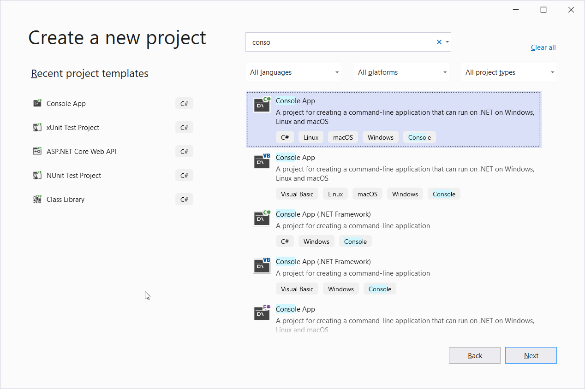

After naming the project, you get an option of using the "new" style of writing a C# program using Top-level statements, or going with the more classic version of choosing a project.  For the purposes of this demo, I'm going with the classic way of building `Program.cs` as I tend to find it a little confusing to show how C# works to a beginner.  So for this I'm clicking the checkbox `Do not use top level statements`:

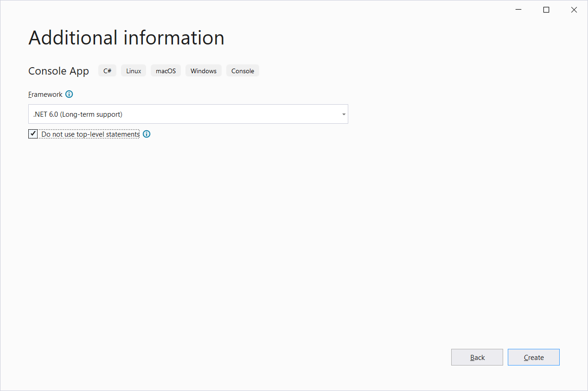

Just for context, if you chose to use top level statements it would look like this:

```csharp
Console.WriteLine("Hello, World!");
```

By contrast, this is an example of what it looks like without:

```csharp
namespace SimpleTestingApp
{
    internal class Program
    {
        static void Main(string[] args)
        {
            Console.WriteLine("Hello, World!");
        }
    }
}
```

At this point, we're going to throw in our *first* test project to be able to cover this program.  We can do that by right-clicking on the solution and going to Add > New Project

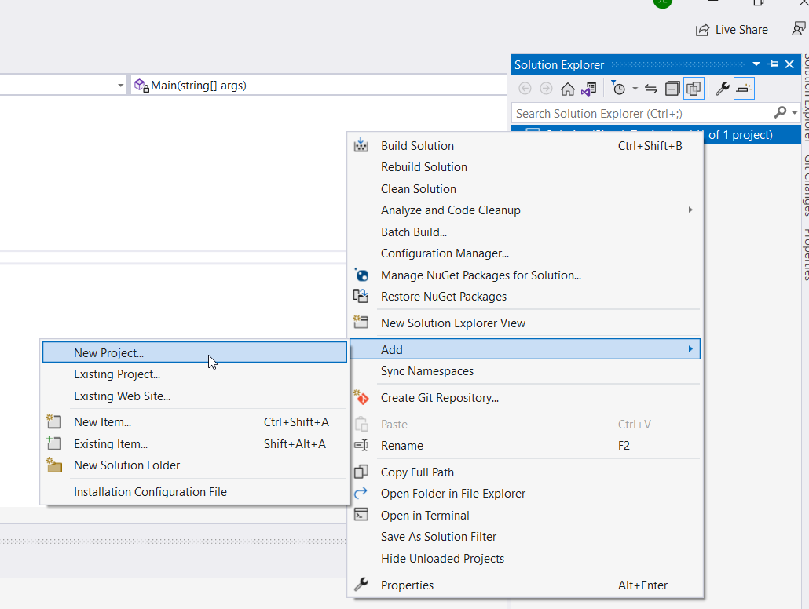

At this point you're going to see a familiar screen asking you to select a project.  Here we're looking for a test project.  By default, Visual Studio gives you access to 3 different testing frameworks based on your choice of project.  These are [MSTest](https://learn.microsoft.com/en-us/dotnet/core/testing/unit-testing-with-mstest), [XUnit](https://xunit.net/) and [NUnit](https://nunit.org/).  Ultimately, all 3 of these testing accomplish the same thing, and I've worked with all of them at various points in my career.  The difference is mainly in exact syntax and documentation.  Although, it's generally considered that MSTest is a little "older" than NUnit or XUnit, so I tend to see it less now.  For the purposes of this demo, I'm going to go with NUnit:

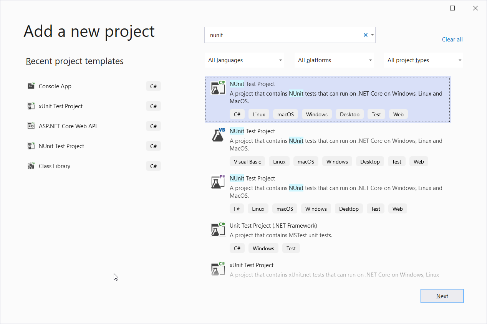

At this point we just hit next, and we get an option to name the project.  In C#, the naming convention is usually `<project name>.Test` as our test projects are designed to be directly related to the project we want to test.  In this case, as the project I want to test is called `SimpleTestingApp`, my test project is `SimpleTestingApp.Test`.

At this point a project should be created a default test file and global using file containing NUnit:

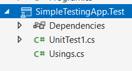

Now at this stage we *could* start writing tests, but in reality we normally abstract code out of `Program.cs` as much as possible because it's static and difficult to test. While we could just create some extra files with the `SimpleTestingApp` project, it's far more likely to create a separate project that contains most of the code.  In this case I'm going to create a `SimpleBankingApp` project.  Given I want to unit test all of my code, what I tend to do is try and group my test projects with my "real" code.  To do this, I right-click on the solution in Solution explorer and go to `add > New solution folder` and name the folder `SimpleBankingApp`.

This is directory I'll create my new projects in, which in this case is a class library and a test project.  Once you've done this, your solution explorer should look something like this:

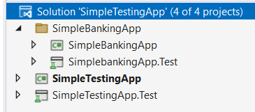

As you can see, Visual Studio automatically changes the icon of the project based on what it is.

## Project to test

So at this point I'm just going to write some code as this section isn't that important, it's testing that we're interested in.  For context, this is what my application looks like:

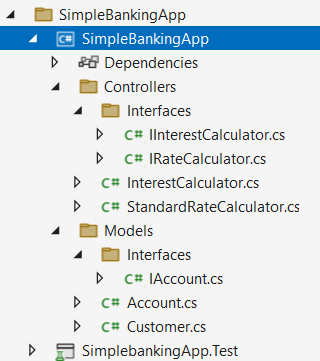

and some of the more important classes:

```csharp
public interface IInterestCalculator
{
    decimal CalculateInterest(IAccount account);
}

public class InterestCalculator : IInterestCalculator
{
    private readonly IRateCalculator _standardRateCalculator;

    public InterestCalculator(IRateCalculator standardRateCalculator)
    {
        _standardRateCalculator = standardRateCalculator;
    }

    public decimal CalculateInterest(IAccount account)
    {
        return account.Age * account.Balance * _standardRateCalculator.StandardRate;
    }
}

public interface IRateCalculator
{
    decimal StandardRate { get; }
}

public class StandardRateCalculator : IRateCalculator
{
    public StandardRateCalculator()
    {
        StandardRate = .032M;
    }

    public decimal StandardRate { get; }
}

public class Customer
{
    public string? Name { get; set; }

    public string? TelephoneNumber { get; set; }

    public List<IAccount> Accounts { get; set; } = new List<IAccount>();
}

public interface IAccount
{
    decimal Balance { get; set; }

    int Age { get; set; }
}
```

This is a really straightforward application which I'm going to use as the base for unit testing.  So I'm going to move on to my testing project for setup.

## Test project setup

First up, I'm using dependency injection to pass in interfaces to the `InterestCalculator` class.  On top of being good practice depend on abstractions, this means my project is perfect for mocking which is the process used to isolate complex pieces of code.  Additionally, one of the primary purposes of mocking is to allow you to run tests without needing to rely on third parties.  For example, when doing web requests or database calls.

In terms of mocking there are several frameworks you can use, but I've mainly relied on [Moq](https://github.com/moq/moq4) and [NSubstitute](https://nsubstitute.github.io/).  Within this demo, I'm going to use NSubstitute as I've found it a little easier to use.

To do this we're just going install it into the test project using the Visual Studio NuGet package manager.  All you need to do is right-click on `SimpleBankingApp.Test` and select "Manage NuGet packages" and then search for NSubstitute:

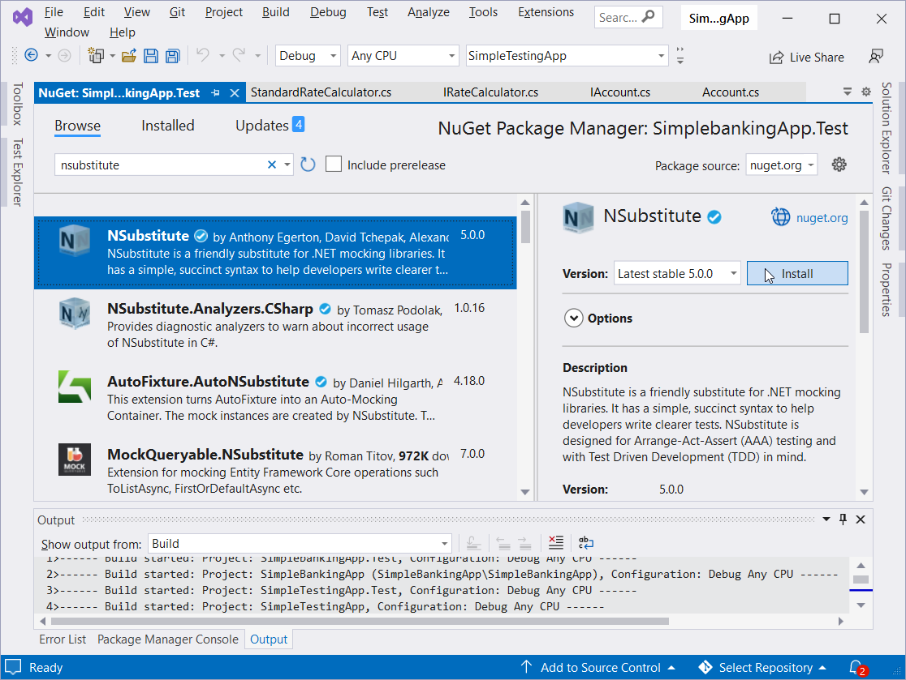

## Writing tests

We're now ready to write some tests.  To start with, as it's slightly more complicated than anything else, I'm going to write some tests for the `InterestCalculator` class.  To do this, I'm going to just create a folder called `Unit` and then a class within that folder called `InterestCalculatorTest` in my test project.  I'll also delete the generate file `UnitTest1.cs`:

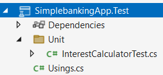

I can now move onto setting up my tests.  This is straightforward in this case, as I have very little to set up.  Pretty much all I want to do is mock out `IRateCalculator` for use throughout the class and as I only need one version of this throughout, I thend to set them up in the constructor:

```csharp
public class InterestCalculatorTest
{
    IRateCalculator _rateCalculator;

    public InterestCalculatorTest()
    {
        // mocking the rate calculator
        _rateCalculator = Substitute.For<IRateCalculator>();

        // telling the rate calculator to return 0.05;
        _rateCalculator.StandardRate.Returns(0.05m);
    }
}
```

If this was to change on a per test basis, I could either construct this object in the test itself, or use a setup method that's run before every test.  For example:

```csharp
[SetUp]
public void Setup()
{
    // mocking the rate calculator
    _rateCalculator = Substitute.For<IRateCalculator>();

    // telling the rate calculator to return 0.05;
    _rateCalculator.StandardRate.Returns(0.05m);
}
```

While there's a lot of setup to get to this point, I'm now ready to write my first test.  In this case, I'm going to check that I can calculate an interest.  In order to do that I'll just create a standard void method.  The hardest part now, is how to name a test.  There are lots of different ways of doing this, but I'm a fan of a 3 part test name, which is separated by underscores.  They contain the following:

1. The method you're testing
2. The expected outcome
3. What you're doing to get that outcome.

In this case, my test name is going to be `CalculateInterest_MakesAnInterestCalculation_WhenCalledWithStandardValue`.  I know this is a bit wordy for the name of a method, but the idea is that it's very clear about what this test is doing.

Once this is done, I instantly add the following to my test:

```csharp
public void CalculateInterest_MakesAnInterestCalculation_WhenCalledWithStandardValue()
{
    // Arrange

    // Act

    // Assert
}
```

This is to always remind me of the 3 parts I need to do when unit testing, and indicates to a developer coming after me what each section of the code is doing.  This because large can b e some of the most confusing pieces code to figure because you can need to do a lot of setup.

Anyway, the parts of a test are as follows:

1. Arrange
   1. Anything that needs to be done to set a test up for a run
2. Act
   1. Where you actually run the method to test
3. Assert
   1. This is where you check that the response from the `Act` step matches what you expect to happen.

I can then fill out the test to be something like this:

```csharp
[Test]
public void CalculateInterest_MakesAnInterestCalculation_WhenCalledWithStandardValue()
{
    // Arrange
    // I'm setting up an account for the test, so this is arrange
    var account = new Account()
    {
        Age = 1,
        Balance = 1000
    };

    // I'm constructing the interest calcualtor, which is arrange
    var interestCalculator = new InterestCalculator(_rateCalculator);

    // I know what the calculation is, so I'm making sure my calculations will match
    // This is usally frowned upon due to creating strong links between code and test
    var expectedInterest = account.Balance * account.Age * _rateCalculator.StandardRate;

    // Act
    // Running the method I want to run is act
    var interest = interestCalculator.CalculateInterest(account);

    // Assert
    // Asserting that the interest will be greater than 0
    Assert.That(interest, Is.EqualTo(expectedInterest));
}
```

**NOTE:** the `[Test]` decorator is the way that the code flags to Visual Studio that this is a test.

I can now check my test is running from the test explorer.  You can get this window by going to `View > Test Explorer`.  Then you just need to press the green button at the top to run a test:

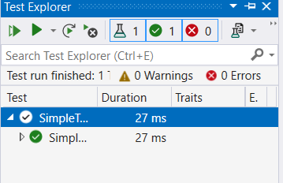

We're now on to the point that can be a little difficult for developers as it requires a different mindset to standard development.  We need to work out how to *break* our code and make sure it can handle those cases.  The first one I can think of, is what happens if somebody has a *negative* account value?  Well, I'd probably ask a question in Teams to see what other people thought, and in this case the code needs to throw an error.

So I'll go back to modify the `CalculateInterest` method so that it throws an error on negative balance:

```csharp
public decimal CalculateInterest(IAccount account)
{

    if (account.Balance < 0)
    {
        throw new ArgumentException("you can't calculate negative balances");
    }

    return account.Age * account.Balance * _standardRateCalculator.StandardRate;
}
```

I can now write a test for this.  As this is a test *related* to the previous one I've worked on, I'll copy the last test and modify it to work for me:

```csharp
[Test]
public void CalculateInterest_ThrowsAnArgumentException_WhenCalledWithNegativeBalance()
{
    // Arrange
    var account = new Account()
    {
        Age = 1,
        Balance = -1000
    };

    var interestCalculator = new InterestCalculator(_rateCalculator);

    // Act and Assert
    Assert.Throws<ArgumentException>(() => interestCalculator.CalculateInterest(account));
}
```

As you can see, I've combined the `Act` and `Assert` sections in the test.  This is because the method throws an exception, which would stop the code execution in normal circumstances.  Therefore, the testing framework needs to catch the error, and we can do this with `Assert.Throws`, but this does mean we can't separate the `Act` and `Assert`.

The next test to talk about, is that if this was a bank, we would have multiple customers, who can hold multiple accounts that we need to calculate the interest for.  You *could* manually construct these objects if you want, but I'm going to use a package called [AutoFixture](https://github.com/AutoFixture/AutoFixture) to make life easier.

How AutoFixture works is that it takes in an object and fills out every field with dummy data.  The big benefit of this, is that if your object changes in the future, you don't need to modify all your tests to take in the new values, AutoFixture will automatically fill them out for you.  You can get AutoFixture in the same way you added NSubstitute to the project.

I can then use AutoFixture in the following manner:

```csharp
[Test]
public void CalculateInterest_CalculatesInterestInUnderTenSeconds_WhenCalledWithTenCustomersWithTenAccountsEach()
{
    // Arrange
    Fixture fixture = new Fixture();

    // This allows us to use fixtures on interfaces, by telling AutoFixture to use a concrete implementation
    fixture.Customizations.Add(
        new TypeRelay(
            typeof(IAccount),
            typeof(Account)));

    var customers = fixture.CreateMany<Customer>(10);
    foreach (var customer in customers)
    {
        customer.Accounts = fixture.CreateMany<IAccount>(10).ToList();
    }

    var interestCalculator = new InterestCalculator(_rateCalculator);

    // setting up a stopwatch to check how long this will take
    Stopwatch stopwatch = new Stopwatch();

    // the maximum time we're giving this method to run
    var maxTime = TimeSpan.FromSeconds(10).TotalMilliseconds;

    // Act
    stopwatch.Start();

    foreach (var customer in customers)
    {
        foreach (var account in customer.Accounts)
        {
            interestCalculator.CalculateInterest(account);
        }
    }

    stopwatch.Stop();

    // Assert
    Assert.That(stopwatch.ElapsedMilliseconds < maxTime);
}
```

This is a fairly advanced implementation of using AutoFixture as I'm using an interface, and the test isn't great as it's pretty slow, but I hope it helps show how powerful it can be when you just need some fake data.

## Other things of note

You might have noticed when you were looking in NuGet, there was a package called [coverlet](https://github.com/coverlet-coverage/coverlet) installed into the project:

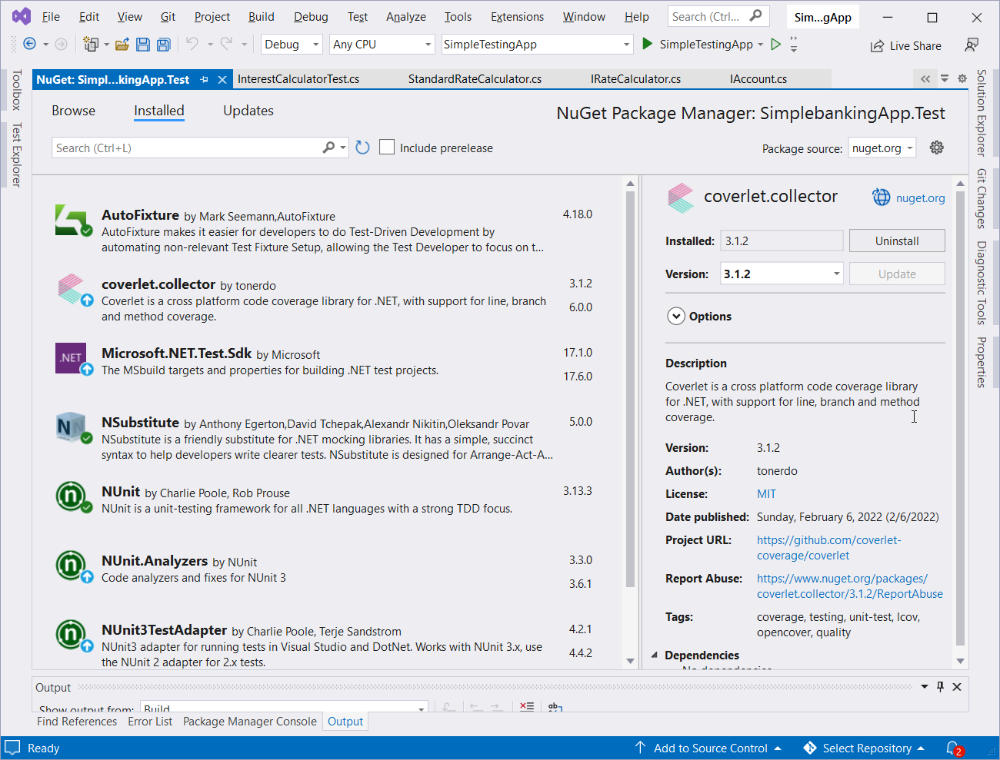

This is a really great tool we can use to implement a paid feature into the community edition of Visual Studio, which is the ability to get test coverage.  It's also the package I use when building CICD pipelines in order to show test coverage in ADO and SonarQube together.

To use this locally, you can run coverlet by going to the package manager console and running the following command:

```powershell
dotnet test --collect:"XPlat Code Coverage"
```

In order to view the results in a human-readable format, you will need to install the NuGet package [Report Generator](https://github.com/danielpalme/ReportGenerator).  Unfortunately, this isn't quite as easy as just installing the NuGet package.

The easiest thing to do is find where the coverage report is generated to, which in my case was a folder called `TestResults` which was at the top level of test application:

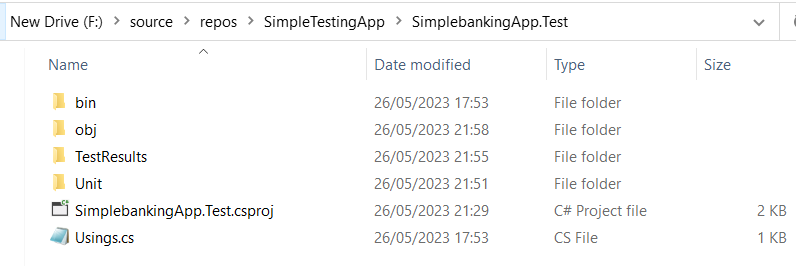

You then need to run the following 4 commands from within that folder:

```powershell
dotnet tool install -g dotnet-reportgenerator-globaltool

dotnet tool install dotnet-reportgenerator-globaltool --tool-path tools

dotnet new tool-manifest
dotnet tool install dotnet-reportgenerator-globaltool
```

Once you've done this, you should see a `.config` folder containing a JSON file and a `tools` folder which has a copy of report generator in it.  This indicates you're ready to run report generator with this command:

```powershell
 dotnet reportgenerator "-reports:.\coverage.cobertura.xml" "-targetdir:.\report"
```

You should see a folder generated called `report` that contains a number of files.  All you need to do to see the report now, is find the file ending in .html and opening it:

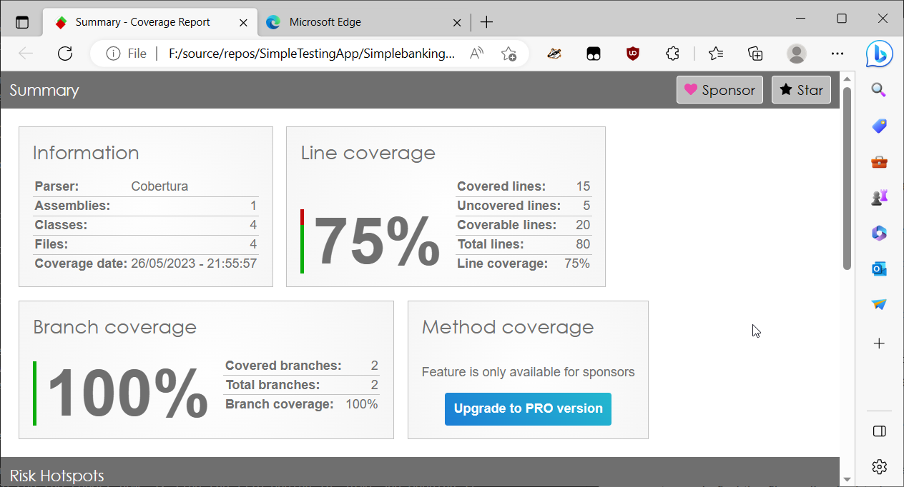
