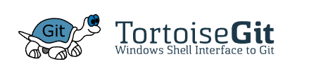
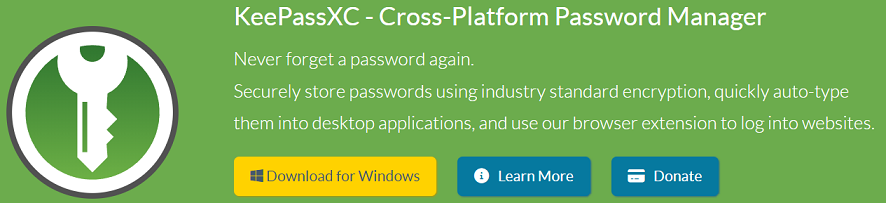
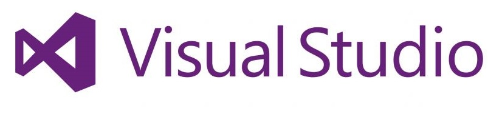
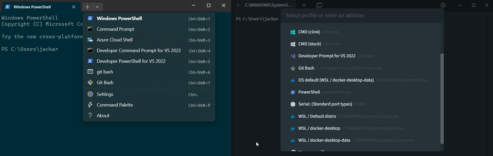

## Background

Whenever you decide to develop software for the first time it can be a little daunting to know where to get started on actually *developing* software.  There is a dizzying array of tools and programs which can be used to develop pretty much anything, while also being told all you need is notepad.  This is a list of some of the tools I use (and some alternatives) to help out when I'm developing software.

### Caveats

It does need to be said before I write anything down that this list is highly subjective and if you have a tool which works great for you, then it's better than whatever I'm recommending.  Additionally, I'm going to keep these tools Windows specific, as that tends to be what I used to develop against.

## Software

Some of these choices are going to be extremely obvious, but they're still worth repeating as I'm trying to write this article in a beginner-friendly manner.

### Git

Starting off with one of the most recognizable tools in software development, Git is used to help track changes to software and helps to avoid losing code.  It was initially developed by Linus Torvalds for supporting Linux and has since grown into a massively popular tool used just about everywhere.

Git can be a little difficult to get started with as it's a command line tool, but documents around its use can be found [here](https://git-scm.com/doc).

### Git GUI tools

Keeping on the Git theme, Git itself can be confusing to learn when you're starting out and one of the ways I found to simplify learning Git was to use a GUI to start with.  There's a lot of them, all of which can help speed up software development if you use them right.  For myself, when I was starting out I used [SourceTree](https://www.sourcetreeapp.com/), before moving on to [GitHub Desktop](https://desktop.github.com/), but I don't use either of these any more because a separate client tended to actually slow me down.  Right now, I use [TortoiseGit](https://tortoisegit.org/) because of its integration directly into the context menu in File Explorer and also the specific Git integrations that are built into the various tools I use to write code.

### Package managers

Windows does have the ability to download packages similarly to Linux and these tools are called package managers.  There's 2 which tend to be most common in Windows [WinGet](https://winget.run/) and [Chocolatey](https://community.chocolatey.org/).  There's a fair amount of history between these two package managers, but I'm currently using Chocolatey a lot more often.  The point of these programs is to vastly simplify the installation process for common software and also quickly share and download large numbers of packages and simplify the update process. Just be aware that Chocolatey (usually) needs to be run from an elevated command shell to work correctly.  A fair number of the programs I'm going to talk about today can be downloaded via Chocolatey.

If you really don't want to mess around with a terminal, but have a new machine you want to install some of the most common tools to, you can use [Ninite](https://ninite.com/) to build out a combined package as well.  However, this isn't really a package manager and more of a quick way to install software once using a GUI tool.

### Password managers

As a developer, we have a lot of passwords and secrets that need to be remembered but only used very occasionally.  It should come as no surprise that a password manager of some description is needed to remember these passwords for you.  While most modern browser's come equipped with password manager features, they are heavily focussed on storing user passwords and nothing else and while you can force them to store more, they aren't built for it.  If you're looking for an all-in-one management solution, then unless you can self-host something like [VaultWarden](https://github.com/dani-garcia/vaultwarden) or are okay dealing with the idiosyncrasies of something like the [free version of NordPass](https://support.nordpass.com/hc/en-us/articles/360006700458-Premium-vs-Free-version-of-NordPass), this is going to cost a monthly fee.  The largest player in the space is probably [LastPass](https://www.lastpass.com/).  This has upsides (lots more devs working on supporting the app) and downsides (most targeted for hacking), so really if you want to go this route, you'll need to do some research.

Alternatively, if you don't mind missing out on some features (such as a built-in MFA authenticator), I use [KeePassXC](https://keepassxc.org/).  I use this particular password manager as it's cross-platform, relatively easy to share passwords across computers (using Google Drive) and has a fairly comprehensive feature set.  I did previously use KeePass, but stopped as that software is windows only meaning I couldn't use it on my phone.

### Authenticator

If you're using passwords to authenticate, you should also be enabling MFA to improve your security.  For this, you need an authenticator.  This can be hardware, using something like a [YubiKey](https://www.yubico.com/), or software based using an authenticator app.  As mentioned earlier, if you're using a tool like LastPass, there are some pretty great authenticators included. However, if you want a free version, there's the [Microsoft Authenticator](https://www.microsoft.com/en-us/security/mobile-authenticator-app) that works on iOS and Android.  If you do choose to use the Microsoft Authenticator, make sure you turn on the cloud backup feature as this will save you a lot of pain if you lose or break your phone.

### Text Editor

For me, a text editor is a pretty important part of my workflow.  I'm always copying text around, or needing to quickly format something and text editors can do this faster than a full-blown IDE or code editor.  When I'm evaluating a text editor, I'm looking for something that I can access via a file explorer context menu, and is really lightweight.  From this, I've found 3 options that work in this role. The first is notepad, that's built into Windows.  I'll use this when I just need to write some quick notes, but it's not what I'll reach for if there's anything more in-depth I need to do (such as formatting JSON and reading scripts).  The next is [vim](https://www.vim.org/), which I pretty much installed for evaluation when I was working on some Linux stuff. I rarely use it nowadays as it's fairly unintuitive, but will work in this role.  The option I use the most however, is [notepad++](https://notepad-plus-plus.org/downloads/).  The reason is that it's a lot more powerful than notepad and easier to use than vim.

### IDE and Code Editors

There was a distinction between an IDE and a code editor in the past where an IDE was considered powerful, but slow, with features like debugging and linting tools.  Whereas a code editor was less capable, but lightweight and designed to work with multiple languages.  However, I do think the lines have blurred heavily from computers getting more capable, and the release of tools like [NeoVim](https://neovim.io/) and [Visual Studio Code](https://code.visualstudio.com/) that can do everything that an IDE can do and more traditional IDEs bringing in greater support for other languages, like Visual Studio [working with Python](https://visualstudio.microsoft.com/vs/features/python/).  My advice on this, is that I use the free language specific tool if there is one, such as [Visual Studio](https://visualstudio.microsoft.com/) for C# and [Eclipse](https://www.eclipse.org/downloads/) for Java.  I should note this is for personal development projects, in an organization I normally use a paid IDE, such as one of the many developed by [JetBrains](https://www.jetbrains.com/) (like IntelliJ).  If I don't have a specific tool, or it's JavaScript based, I'll use Visual Studio Code.

### Browser

I know this sounds extremely obvious, but the *choice* of browser can actually be really important as (while this has gotten a lot better recently) different web browser's can render content differently (who else remembers the dreaded *this website only runs on Internet Explorer*).  What this means is that if you want your website to look like what the vast majority of your user's experience it's a good idea to track something like the most popular browsers. For example, [the w3schools website](https://www.w3schools.com/browsers/) shows that Google Chrome has a market share of nearly 80% across 60 million visits.

This is one of the reasons I use Google Chrome as my primary browser, but I am hoping that [Arc](https://arc.net/) comes to Windows, which is also based on Chromium.

### Log Monitor

There are two sides to this one, a centralized log management tool and a more general log monitoring tool that works like a modified text editor.  These are both really useful for different things.

First up is a centralized log management tool such as [Splunk](https://www.splunk.com/) or [elastic](https://www.elastic.co/).  The reason for the existence of these tools is pretty straightforward: `if you have 100000 instances, and a 0.1% occurrence on a per instance basis, there are 100 examples of that issue in production`.  While you might laugh about ever running 100000 instances of your software, this absolutely does happen in industry and there are many issues with a higher occurrence than 0.1%.  One of the ways you can track this is with a centralized log management tool, which will be able to tell you how common an issue is. Additionally, these systems are useful for real-time log monitoring which can pinpoint very quickly when there is a major issue occurring. While I wouldn't say it's the best idea to try and have one of these tools ready to go on your desktop as there are loads of them, understanding one of them can give you a deeper insight on how to manage and collate log files.  If you are still interested, I have a (short) tutorial on how to use [OpenSearch](https://opensearch.org/) found [here](https://dev.to/jlewis92/building-a-devto-analytics-dashboard-using-opensearch-39m8) that can also be used for centralized log management.

The second part to this, is a log monitoring tool.  These are useful for analysis rather than monitoring.  In my experience, once an error has been found, the most difficult errors to diagnose actually start throwing up signs in a log long before an actual error is shown, meaning that you need to hunt through a log file for some sort of error.  While you can upload entire log files to a centralized log management tool, this can cost a lot of money based on the amount of data that you're putting into one.  For example, I've personally witnessed an ElasticSearch cluster dealing with well over a terabyte of log files per week and this was several years ago.  You can probably imagine how expensive that was just to store it in AWS!  All this adds up to needing some form of tool to look through a log file.  While you can just use a text editor like Notepad++, a dedicated log monitor can vastly speed up and simplify the diagnosis process.  There are a few tools that can do this, such as [BareTail](http://www.baremetalsoft.com/baretail/) (there's also a chocolatey package of the free version found [here](https://community.chocolatey.org/packages/baretail)) or [KLOGG](https://klogg.filimonov.dev/), which is free and open source. The reason you would use a log monitor over a text editor is that they are optimized for opening massive log files quickly and provide a clear display of data, regex based highlighting tools (useful for support) and speed.  They also work much better over a slow network than a text editor in my experience.

### Terminal

By terminal, I don't mean specific software related to a scripting language, PowerShell or Command Prompt.  I really mean one of the much newer combination terminal programs like the aptly named [Terminal](https://github.com/microsoft/terminal) by Microsoft or [Tabby](https://tabby.sh/).  The benefit of these programs is that they allow you to run multiple terminals via a tabbed interface.  They both are pretty similar but with some differences.  For example, Terminal has access to the command palette found in vscode and Tabby has plugins that can be installed as well as a password vault built-in for secrets.  Both have the ability to customize the terminal appearance, run shells as an administrator and have customized shortcuts to simplify terminal use.

### Sysinternals

Probably less useful for a web developer, but these tools can be a lifesaver when trying to diagnose complex issues in a Windows environment.  This is a collection of tools developed to help show what is happening under the hood.  They can be downloaded [here](https://learn.microsoft.com/en-us/sysinternals/downloads/sysinternals-suite).

Really, there's far too many tools in this pack to go into any real detail, but can roughly be split into monitoring tools and helpers.  Some of the highlights within the monitoring tools are process explorer (a more powerful version of task manager), syslog and process monitor (both used to monitor logs in Windows - very useful for diagnosing issues with services!).  Essentially, if there's some information you would like to know about what's happening in Windows, there's probably a tool in Sysinternals that can help out.  On the helper side, there are tools like Autorun (that provides a detailed interface into running things on startup), Autologon (simplifies the automatic logon process setup in Windows) and ZoomIt (A series of tools used to make performing presentations easier).

### Screenshot and recording tool

While using the Windows default `prntscr` button will get you perfectly adequate screenshots (especially when using `alt + prntscr`) there's always a time when I want something a bit better.  There's even one already built into Windows! You can access the snipping tool using `Windows + shift + s` which gives you the ability to select what *part* of a screen you want to screenshot.

However, the tool I personally use is [ShareX](https://github.com/ShareX/ShareX).  The benefits of this tool is everything that the snipping tool can do *and* the ability to quickly record videos for demonstrations.  A video of how something works makes it so much easier for someone who is not so involved in the technical side to understand how something works and is easier for the developer as it reduces the need for time-consuming and stressful demonstrations.  It's also useful for test teams as it instantly shows how to reproduce a bug without playing email bingo over how to get a bug to manifest.

### Docker

I think Docker should really be self-explanatory.  It sometimes feels like I can't go a single day without hearing *Somebody* talking about Docker.  However, it's rightfully popular as it massively simplifies the process of running an application and offloads the complicated bit of managing a server.  A full explanation of Docker is outside the scope of this article (and you can probably find one if you spend 5 minutes browsing DEV), but in short it works by running applications in a container, which provides separation from the underlying infrastructure and helps to guarantee that the application will start the same way every time because they contain only the things needed to run an application. There's also a strong focus on programmatically building working containers so that updating and deploying the application can be done from a button press, rather than a manual upgrade process.

### Windows subsystem for Linux

You can't really talk about Docker without also mentioning the tool it uses to run Linux images on Windows.

The Windows Subsystem for Linux (usually shortened to wsl2) is a how you can get a Linux operating system running on top of Windows directly from [the Windows store](https://apps.microsoft.com/store/detail/ubuntu/9PDXGNCFSCZV).  It vastly simplifies the process if you need to work on something Linux, but don't have access to another machine.  This is an alternative solution to using a full-blown virtual machine like [VirtualBox](https://www.virtualbox.org/) and on top of being heavily integrated into Windows, is a lighter weight (and therefore quicker) option.

### PDF Reader

While the vast majority of information found on a system is written on the internet, it's still pretty common to encounter a PDF file for documentation.  This goes triple of you're working directly with a supplier to integrate some closed source hardware or software.  At work, I do just use the in-built tools in chrome to view a PDF as it's easy, and I don't need to justify having it installed on my machine to a sysadmin. However, at home I use [Foxit](https://www.foxit.com/) because it massively reduces the buffer time to *load* a PDF and has a lot of features in the free version that aren't replicated in Adobe Acrobat.

## Ending notes

Once again, I do need to reiterate that this is *all* personal preference, and frankly there's a lot of tools out there that are better than what I use, but in general I've found that everything I've used has helped me personally to be more productive.
