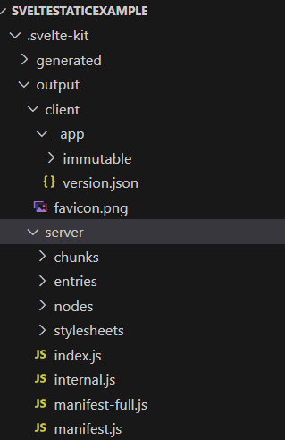
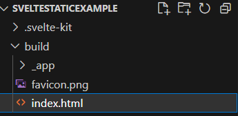
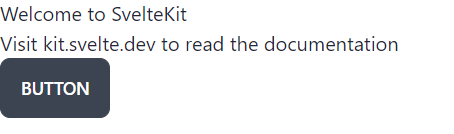
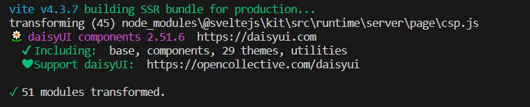
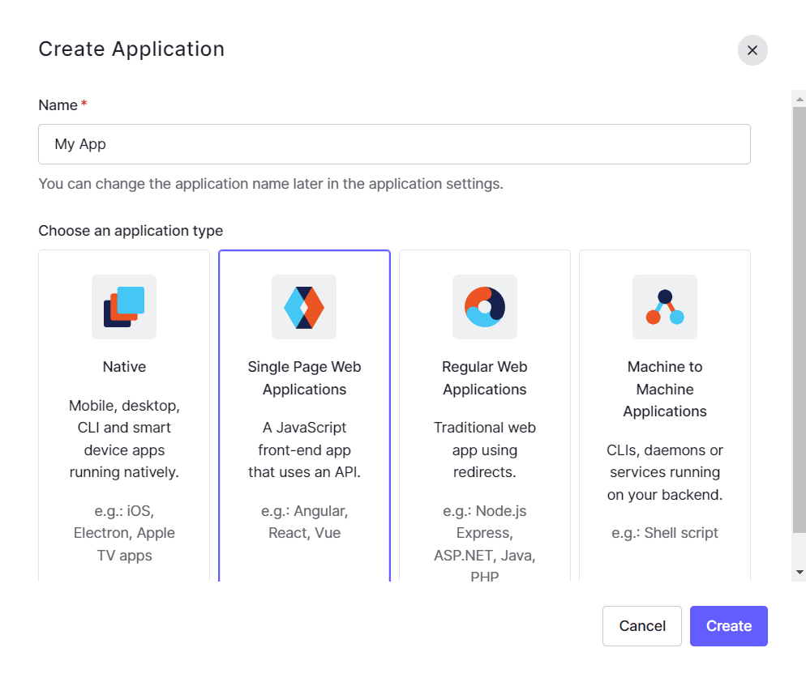
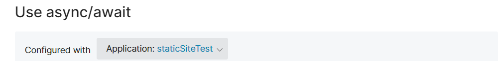
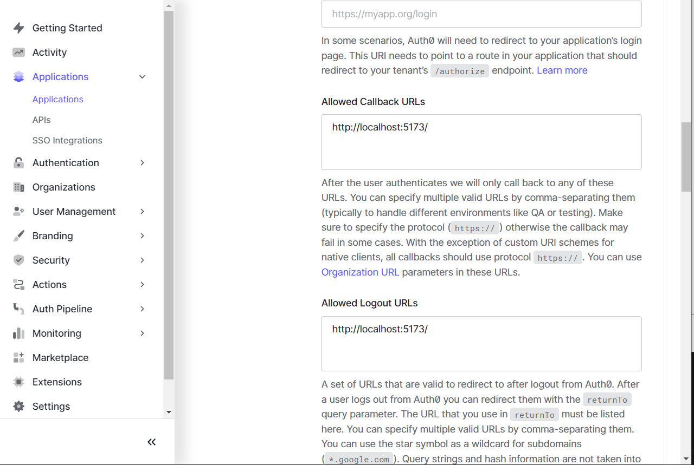

## Preface

[Svelte](https://svelte.dev/) is an up and coming JavaScript framework being developed by Rich Harris (and the Svelte team).  It's gained acclaim for being very simple to use, reducing boilerplate and generally being a nice platform to develop new web apps on.  This article is an attempt to explain how you can leverage the power of Svelte to create modern static sites that can be hosted from simple file storage like S3 in AWS.

While hosting the application is outside the scope of this article, I do have another [here](https://dev.to/jlewis92/the-aws-cloud-resume-challenge-4p17) which explains how to do the hosting within it.

It needs to be understood, that converting Svelte to run in a static context will; mean that a lot of the features touted by the Svelte team will be disabled.  However, I still feel it's worth it, as writing in Svelte is still a really nice experience.

## Benefits

The main benefit of this approach is cheap hosting.  You don't need to run a docker container or a machine in your cloud service provider of choice, which reduces the cost of the website as you're only paying for serving files.  Additionally, many cloud service providers have products that allow you to leverage a [content delivery network](https://www.cloudflare.com/learning/cdn/what-is-a-cdn/) easily.  Finally, static applications are *fast* because there's no need communicate backwards and forwards with a server, it just downloads some files to the browser.

## Drawbacks

Essentially, all server based code in a Svelte will not work using static hosting.  Given Svelte is split into code that runs everywhere and code that runs in the server, this can be a little annoying.  You'll need to remove all `.ts`/`.js` files that contain the `server` keyword (i.e.: `+page.server.ts` or `+server.js`) as these files won't work.  Additionally, some features ofSvelte won't work such as [dynamic routing](https://joyofcode.xyz/sveltekit-routing#dynamic-routes) and [server side rendering](https://learn.svelte.dev/tutorial/ssr).

## Tutorial

### Prerequisites

You'll need an up-to-date version of your favourite node based package manager.  I'm using npm, but pnpm and yarn both work.

### Installation

to start with we need to create aSvelte app from the terminal:

```node
npm createSvelte@latest
```

It will ask you a few questions about how you want to set up your project.  For the cases of this demo, I went with a skeleton project and with TypeScript.  You select options (such as prettier) using the space bar.

You then need to run the installation:

```node
npm install
```

Just for context, you can run `npm build` at this stage to see what the built output looks like without convertingSvelte to run as static. You can see it just generates a large number of files in the `.svelte-kit` folder.  You can run from this directory using `npm run preview`:



### Converting to static

It's really quite straight forward to convert aSvelte app to run in a static context.  Svelte does this using [adapters](https://kit.svelte.dev/docs/adapters).  By default, Svelte uses the `auto` adapter which works best for general cases. There are a few different adapters, and you choose which one based on what you're doing.  For example, there are adapters based on providers (such as Netlify or Vercel) however, the one we're interested in, is `adapter-static` which makes Svelte run like a static site generator.

In order to get this to work, all you need to do is to install the `adapter-static` package:

```node
npm i -D @sveltejs/adapter-static
```

 Then go to `svelte.config.js` at the top level, and change the line talking about `adapter-auto` to say `adapter-static`.  I.e.:

```javascript
import adapter from '@sveltejs/adapter-auto';
```

to

```javascript
import adapter from '@sveltejs/adapter-static';
```

**NOTE:** there's a lot of additional settings you can set for this, but for the purposes of this guide, we're not going change any of the defaults.

At this point you can try and build the application, and it will instantly spit out a warning about dynamic routes in the `src/routes` folder.  It gives you a bunch of options on how to fix this, but the simplest is to create a file called `layout.{ts|js}` in `src/routes` and then place the following into it:

```typescript
export const prerender = true;
```

This forces all files in the `src/routes` folder to be prerendered, which is what we need for a static site.

At this point, if you run `npm run build` you should see a `build` folder created that contains an `index.html`, which is the entry point for the static site:



### UI library

Usually, one of the first things I do on creating a new web app is to throw a UI library in to help style components.  There are [several](https://joyofcode.xyz/svelte-ui-libraries) UI libraries that can be used by Svelte, but in this case I went with [daisyUI](https://daisyui.com/) because it's a fairly popular UI library which includes [tailwind](https://tailwindcss.com/).  To install daisyUI, you first need to install tailwind.  There's a few different ways to do this (such as [this](https://tailwindcss.com/docs/guides/sveltekit) guide), but the easiest way I've found is the following command, which also adds [PostCSS](https://postcss.org/) and [AutoPrefixer](https://autoprefixer.github.io/):

```node
npxSvelte-add@latest tailwindcss
```

You should then be able to install daisyUI:

```node
npm install daisyui
```

The final step for daisyUI is to then add a plugin for daisyUI into the `tailwind.config.cjs` folder.  It should look something like this:

```javascript
/** @type {import('tailwindcss').Config}*/
const config = {
    content: ['./src/**/*.{html,js,svelte,ts}'],

    theme: {
        extend: {}
    },

    plugins: [require("daisyui")],
};

module.exports = config;
```

You can tell that daisyUI is installed correctly in 2 ways, the first is to add a styled component, like a button:

```html
<button class="btn">Button</button>
```



or alternatively, you can run `npm run build` or `npm run dev` and the output tells you that daisyUI is installed:



### Animations

While Svelte has a pretty good built-in library of animations, if I do need some more custom animations, I don't actually use a library, but I do use [Animista](https://animista.net/) to pick out something which works for me.

### Repository Setup

I talk about this in more detail in my article [here](https://dev.to/jlewis92/my-setup-for-publishing-to-devto-using-github-1k0n), but I'm a big fan of adding [pre-commit](https://pre-commit.com/) into my git repositories to help out.

### Login

Whether it's a good idea or not, it's definitely possible to add login functionality to a static site.  This can be done through JSON web tokens and the OAuth [Authorization code flow](https://auth0.com/docs/get-started/authentication-and-authorization-flow/authorization-code-flow).  How this works is that we offload authorization to a third party, that then returns a token that verifies a user is logged.  That token can then be used to authenticate with an API somewhere.  This can be a little difficult to get your head around, but this essentially what happens when you click the "log in with Google/Facebook/GitHub" button on a website and is known as "Single Sign On" or "SSO".

We're specifically using the authorization code flow as this is the one needed for when the entire website is served to the browser i.e. when using a static website.

If you *do* want to add login functionality to a static website, you need to make sure that all data related to a user comes in from an authenticated backing API.  For example, API gateway in AWS.  The reason for this is that any data you serve to a website can be modified by the client, meaning that somebody could "force" a login by just changing the JavaScript locally. You need to stop this by making something like an OAuth token required on every call to the backend, as this is verifying that a user has access to those resources.

#### Why?

This can be a little counterintuitive to do as if you're doing this, why don't you just use server side features of Svelte and avoid a separate API all together, which would likely be faster than offloading the calls to the browser.  The answer to this is mainly in cases where you have a public API being used by others, as well as yourself or that you're using the same resources with multiple OAuth flows, such as the [client credential flow](https://curity.io/resources/learn/oauth-client-credentials-flow/) for machine to machine calls.  As such, this can be useful on admin portals for application support.

#### How to add

Just about every cloud provider has their own implementation of a JavaScript library that can offload the complexity of writing your own implementation.  For example, AWS has [Amplify](https://aws.amazon.com/amplify/), GCP has [Firebase](https://firebase.google.com/docs/auth/web/firebaseui) and Azure has [Identity](https://learn.microsoft.com/en-us/javascript/api/overview/azure/identity-readme?view=azure-node-latest).  You can also use a more generic library like [Auth.js](https://authjs.dev/reference/sveltekit). However, I'm going to go with [Auth0](https://www.Auth0.com/) in this guide as I've not used this service before, and it's a slightly more "neutral" option than going for a service offered directly by a cloud provider.  Additionally, Auth0 will allow you to get started without needing to add a credit card, which makes it useful for demonstrations.

Picking the best service for your needs is outside the scope of this article, but safe to say a lot of considerations to keep in mind.  This can be everything from a cloud provider offering a tighter integration with their own products to the number of monthly free users you're allowed (called MAU's) to the number of SSO [providers](https://en.wikipedia.org/wiki/List_of_OAuth_providers) offered for integration.

#### Setup

To start with you need to sign up for an account with Auth0 and add the Auth0 single page app SDK to your Svelte application:

```node
npm install @auth0/auth0-spa-js
```

After this, you need to go into the front page of Auth0, and click "create application" and select "Single Page Application":



There's a large number settings you can use, but that's outside this guide.  However, a nice feature of the documentation is that if you're logged in, the documentation will be updated to use details for your account:



You then need to set callback and logout URL's. Svelte usually sets the startup port as 5173, but pick whatever you need:



I've put localhost in at the moment as I'm just running this locally.  Obviously if you're actually running this, just set the callback and logout URL's to the valid paths there.

At this point all you need to do to set up the login functionality is to construct the auth0 object:

```javascript
import { Auth0Client } from '@auth0/auth0-spa-js';

const auth0 = new Auth0Client({
    domain: '<domain>',
    clientId: '<client id>'
});
```

and then you can start the login process by setting up a button which calls Auth0:

```javascript
async function login() {
    await auth0.loginWithRedirect({
        authorizationParams: {
            redirect_uri: 'http://localhost:5173/'
            }
    })
}

<button on:click={login} class="btn">Login</button>
```

If you press the button, it should take you to the Auth0 login page where you can now sign up a user.  It also handles email verification and SSO.  Once you do this, it should redirect you back to your application.  You can tell it's working at this point if you can see that you have token in the URL as a query parameter.  For example:

```text
http://localhost:5173/?code=tlcjskafaUOODPicz_P83g6YrwgiFxOO7PXv0gNZAKDsC&state=ekdCQzFRZjllTmJyOTUwcU5XWjNqV0RQN04wZC11alZ0UHB1Q0hPNElYTQ%3D%3D
```

In order to handle this, we need to call the `auth0.handleRedirectCallback()` function on page load.  This can be done using `onMount` in Auth0:

```javascript
import { onMount } from 'svelte';

onMount(async () => {
    await auth0.handleRedirectCallback()
    .then(async () => {
        const user = await auth0.getUser();
        console.log(user);
    })
    .catch(() => {
        console.log("not authenticated");
    });
})
```

Logout functionality is just as straight forward:

```javascript
async function logout() {
    await auth0.logout();
}
```

For context, here's a full minimal implementation of this:

```svelte
<script lang="ts">
    import { Auth0Client, User } from '@auth0/auth0-spa-js';
    import { onMount } from 'svelte';

    const auth0 = new Auth0Client({
        domain: '<auth0 domain>',
        clientId: '<auth0 client id>'
    });

    let user: User | undefined;

    async function login() {
        await auth0.loginWithRedirect({
            authorizationParams: {
            redirect_uri: 'http://localhost:5173/'
            }
        })
    }

    async function logout() {
        await auth0.logout();
    }

    onMount(async () => {
        await auth0.handleRedirectCallback()
        .then(async () => {
            user = await auth0.getUser();
        })
        .catch(() => {
            console.log("not authenticated");
        });
    })

</script>

<button on:click={login} class="btn">Login</button>
<button on:click={logout} class="btn">Logout</button>

{#if user != undefined}
    <p>hello {user.nickname}</p>
{/if}
```

The final thing to talk about, is that if you want to get the token to use in an authorization header for retrieving data through an API, you can get this using either `auth0.getTokenSilently()` or `auth0.getTokenWithPopup()` depending on your needs.

While it's outside the scope of this article, Auth0 provides documentation about how to integrate with all the major cloud providers.  For example, the documentation for how to implement Auth0 with AWS API Gateway is found [here](https://auth0.com/docs/customize/integrations/aws/aws-api-gateway-custom-authorizers).
