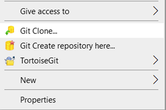
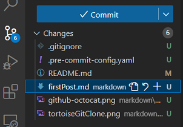
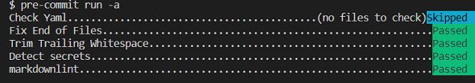
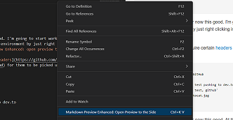
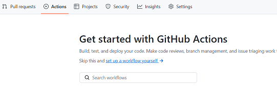

This article is mainly around so that I can rmemember my current setup and maybe it'll help you be more productive but it's essentially a guid on how to setup vscode and GitHub to be able to post to Dev.to

## Prerequisites

- Dev.to account
- GitHub account
- git
- vscode

## First steps

You need to create a github repo and name it something that makes sense to you. For me that's DevToArticleRepo. On this repo I just set a simple description and use the MIT license, because it's easy to do and start as a private repo, just in case

Once you've done this you need to pull down the repository using your favourite git tool.  I tend to use tortoise git to start off with, then move to using vscode once it's pulled down




## Repository setup

If I've not got a .gitignore (because I couldn't be bothered to search usually!) I add an empty .gitignore ready for me. I also like to add some [pre-commits](https://pre-commit.com/).  to my repository to help out.  In every repository I make I tend to add the check-yaml,  end-of-file-fixer, trailing-whitespace and detect-secrets.  Also, as this is a primarily markup repository, I also add markdownlint.

For reference, here's the .pre-commit-config.yaml for this repo

```yaml

repos:
    - repo: https://github.com/pre-commit/pre-commit-hooks
      rev: v2.3.0
      hooks:
          - id: check-yaml
          - id: end-of-file-fixer
          - id: trailing-whitespace

    - repo: https://github.com/Yelp/detect-secrets
      rev: v1.4.0
      hooks:
          - id: detect-secrets

    - repo: https://github.com/igorshubovych/markdownlint-cli
      rev: v0.33.0
      hooks:
          - id: markdownlint
            args: ["--disable=MD013"] # this removes line length warnings

```

I then just run `pre-commit run -a` to make sure my current repo is good:


## Visual studio code setup

As I'm using vscode for this, I also installed a few extensions to make my life easier:

- [SpellChecker](https://marketplace.visualstudio.com/items?itemName=swyphcosmo.spellchecker)
  - I think this should be obvious why this would be helpful!
- [Markdown Preview Enhanced](https://marketplace.visualstudio.com/items?itemName=shd101wyy.markdown-preview-enhanced)
  - Mainly so I can get the markdown preview to not be in dark mode, like it's probably going to be viewed in
- [Markdown All in One](https://marketplace.visualstudio.com/items?itemName=yzhang.markdown-all-in-one)
  - Provides an easier way to format markdown

At this point I'm ready to start setting up my folder structure for the markdown.  As it's just starting out and I'm definitely going to be below the 500MB limit GitHub gives you for a basic repository. It looks something like this:

```markdown

DevToArticleRepo
├── .git
├── markdown
│   ├── assets
│   │   ├── github-octocat.png
│   │   ├──tortoiseGitClone.png
│   │   ├──moreImages.png
│   ├── firstPost.md
├── .gitignore
├── .pre-commit-config.yaml
├── LICENSE
└── README.md

```

I'll probably revise this, but for now this good. I'm going to start working on the file `firstPost.md`. In order to do this I setup my environment by just right clicking in the file `firstPost.md` and select `Markdown Preview Enhanced: open preview to the side`


## Dev.to setup

Once this is done, I'm ready to start editing the markdown. By default, Dev.to articles require certain [headers](https://github.com/sinedied/devto-github-template/blob/main/posts/example.md) for them to be picked up, so this file has been started with the following:

```markdown

---
title: Pushing to Dev.to using GitHub
published: true # if you set this to false it will publish the page as a draft
description: An article used to test pushing to Dev.to
tags: 'productivity, beginners, test, github'
cover_image: ./assets/github-octocat.jpg
canonical_url: null  # set this if you have a website you want to be promoted
---

```

Once this is done, you can write your [markdown](https://github.com/adam-p/markdown-here/wiki/Markdown-Cheatsheet) article

## GitHub setup

At this point, you've hopefully written your article and we're pretty much done with the git side and you can close the 200 windows you have open explaining how to style markup. After this we'll get ready to setup the GitHub actions project for pushing this code into the repo

It's pretty straight forward to get started, all you need to do is grab an API token from Dev.to and place it in the repositories' [secrets](https://docs.github.com/en/actions/security-guides/encrypted-secrets) tab with a memorable name.  You can find the API key by clicking on your profile picture and going to `Extensions >  generate API key`

We can now start working on the "free" build (GitHub gives you a load of credits every month) with GitHub actions by going to actions and selecting set up a workflow yourself:



## Writing the build pipeline

Once started, the main thing we're going to be doing is using the following [extension](https://github.com/marketplace/actions/publish-to-dev-to) which allows you to publish to Dev.to.  It's really quite straightforward and I've got the below github actions yaml file to publish it

```yaml

# runs on pull requests, manually, and the main branch
on:
  pull_request:
  workflow_dispatch:
  push:
    branches:
    - main

jobs:
  my_job:
    name: push details to Dev.to
    permissions:
      contents: write # this lets the bot update the post in github
    runs-on: ubuntu-latest # ubuntu costs half the price of windows

    steps:
    - uses: actions/checkout@v3 # checks out my code to the actions build
    - name: Publish articles on Dev.to
      uses: sinedied/publish-devto@v2
      with:
        devto_key: ${{ secrets.SECRET_DEVTO_TOKEN }} # the secret you setup
        github_token: ${{ secrets.GITHUB_TOKEN }} # this is an inbuilt secret by github
        files: 'markdown/**/*.md'
        branch: main
        conventional_commits: true
        dry_run: false # set this to true if you want to do a dry run

```

If this updates in the future, it can be found [here](https://github.com/jlewis92/DevToArticleRepo/blob/main/.github/workflows/main.yml)

Once this is done, just commit the file and the GitHub action should run.  All being well

**_NOTE:_** your repository needs to be public to get the code to work if you have any images, otherwise you'll get errors around images not being public
