Before I get into this post, I just want to say I'm pretty new to networking - before I started this process the only real knowledge I had was what I'd picked up in my job as a software developer, which tends to be less focused on in-depth configuration of a network, and more in making sure you aren't leaking credentials through a gateway or setting up a networked [PED](https://en.wikipedia.org/wiki/PIN_pad).  As well as what I've picked up over the years from being interested in tech, like setting up a NAS or changing my DNS/IP settings.  I should also say this is less a guide (please checkout the ones I've linked below if you're truly interested) and more a write-up of some the challenges and interesting things I came across.  This is a really lengthy post, and possibly not the right audience, but I do think it's useful for a software developer's to understand some of the networking side because (at least for me) a lot of the things we work on nowadays are internet enabled.

I'd also like to say I couldn't have done any of this without guides, which pretty much walk you through the process. The main ones I referenced (with a few idiosyncrasies) were the ones below:

- [NGUVU](https://nguvu.org/pfsense/pfsense-baseline-setup/)
- [Schnerring](https://schnerring.net/blog/opnsense-baseline-guide-with-vpn-guest-and-vlan-support/#dns-services)
- [0x2142](https://0x2142.com/how-to-set-up-adguard-on-opnsense/)

Clicking on these links will be spoilers for some of the sections below, but I'll be referencing them at various points throughout this post so I thought easiest to just get them out the way.

## Rationale

This is ultimately, the question of why did I want to spend a bunch of time and effort on potentially destroying my internet for something which at the end of the day does the exact same thing as the router provided by my ISP?  In a nutshell, because I wanted to.  ?In (slightly) more detail, I wanted resilience to change ISP's without having to rebuild my network every time, I wanted to get away from the router provided by my isp, gain greater control over my network than I've ever had before and I've always wanted to learn how to do this from scratch.  In addition, I'm looking to host a fairly involved homelab on my internal network and my thinking was, start from the beginning and then work outwards, as if I go the other way I know I'd be dreading messing with a working network which is already running all of my stuff.

## What do I want?

This is in no particular order, but this is generally what I was keeping in mind when initially deciding to go about this project:

- highly configurable
- split traffic between guest and my own personal devices
- network level ad-blocking
- network level VPN
- get the router to hand out specific DNS settings - *think I ended up going a bit overboard on this...*
- increased ability to block malicious traffic
- open source
- Be in charge of exactly what my network is doing
- help me understand more about networking
- quiet, as it's going to sit in my living room

## Router/AP combo or split devices?

I should start this out by saying I'm considering the router as a firewall/router combo

I think when starting out, you need to decide if you want to put everything into 1 device which does both routing and works as an access point (it would still require a separate switch just to handle all the devices I plan to hard-wire at some point), or if you want to split these up, you have router which connects to a switch, which then connects to an access point. There are (of course) a ton more options for setting up networks, but this is what I'm focusing on as a home user.  From my current understanding, major players in the "AIO" space include (but are not limited to) Eero, ASUS and Google WiFi. Within splitting everything apart, you can find Cisco and then there are the companies which do both, such as TP-Link and Ubiquiti.  You can also go the "DIY" route and use a PC as a router.

I don't really get into pros/cons of both these approaches, but for me, while there's no issue with going router/AP combo, when you split these things up you do get greater control over your network and you can more easily role out an update to your network infrastructure as you don't need to replace both at the same time.  By contrast, router/AP combo's tend to work out cheaper for the same functionality and less power hungry.  I ended up going with splitting these devices apart as I wanted the extra control.  Additionally these combo devices usually make it a bit more difficult to use any other software on them than the one built into them, which is almost closed source.  There some alternatives which can use such as [OpenWrt](https://openwrt.org/), but you do need to do extra research to make sure the device can actually support this.

## Ecosystems

At this point, I had a choice between going with an established company for a router/firewall, or going the DIY route.  If you decide to choose to use an ecosystem, three of the options I considered were [TP-Link Omada](https://www.tp-link.com/uk/omada-sdn/), [Ubiquiti Unifi](https://ui.com/) and [Cisco Meraki](https://meraki.cisco.com/en-uk/) (promptly discarded for how [expensive](https://itprice.com/cisco-gpl/meraki) it is). It should be noted, that these ecosystems use software based controllers and can be run from the cloud (such as the Omada cloud controller - this typically costs a monthly fee) or from another computer you own, or through a specific device sold by these companies (such as the Unifi Dream Machine Pro).  Among the benefits of this route are much greater support when you have issues and a simplified and well integrated setup between devices.  However, I decided not to go this route as you're absolutely locked into the vendors ecosystem, making you heavily dependent on these companies for future updates - especially if you go cloud based.  For me, I thought the best bet was to go DIY as it gives you the best opportunity to be in control and I had much less vendor lock in.  For example, I could choose between using pfsense, OPNsense, Untangle (I discarded this one as it costs a yearly fee) and IPFire (I didn't really know about this one until I'd already started the process).  You can then choose an access point from any company to sit on top of it

## Hardware

I've now got my base ecosystem decided, and I'm going to need 4 separate devices to run my network:

- a modem
  - I'm just using the router provided my ISP for this
- a router
  - I didn't have a spare computer lying around so I bought one for this job
- a switch
  - I have a fair few devices to run, so I'll need some extra ports
- an access point
  - I do have a small house, so I don't actually need more than one to cover my entire house

I think my advice here, is that if you're trying to DIY, the big benefit is that you're fairly hardware agnostic. Therefore, don't get hung up on brand names - instead pick a feature set that you want and then go from there.

### Router

In the router I had a few things I wanted:

- low power consumption
- passive cooling
- at least 3 ports on the router (for LAN, WAN and VLAN's)
- low power consumption
- good price to performance ratio

I think at this point, it's obvious I was looking at either [pfsense](https://www.pfsense.org/) or [OPNsense](https://opnsense.org/) and I'll talk about these in more detail later, but specifically both of them do have an owning company that produces hardware that comes preinstalled with the software.  However, while this is going to be heavily supported by the company you buy them from, they are both really expensive options.  For example, the cheapest 4-core [NetGate router](https://shop.netgate.com/products/6100-max-pfsense?variant=39347093078131) with 128Gb of storage costs 900$ and comes with an Intel atom processor from 2017.  It does however, have much better networking than you can get with a typical DIY solution as it comes with dual SFP ports (supporting up to 10Gbps) and double the number of RJ-45 ports (LAN at 2.5Gbps and WAN at 1Gbps) that I want.  On the OPNsense side, the [cheapest router](https://shop.opnsense.com/product/dec695-opnsense-desktop-security-appliance/) which doesn't have flash memory is €650 and the CPU is "G Series" with DDR3 RAM and 4 1Gbps RJ-45 ports.  Once again, it's worth mentioning that as a home user, I'm probably not the target market for these devices, but it does show why I'm not going to go with one of the official routers.

After this there was just a load of searching for a combination of parts and standards, I ended up going with this:

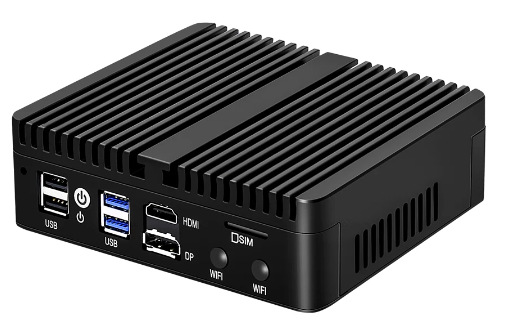

It's a AliExpress special from Topton computers, that cost me around £130 for the barebones version. This is after taxes and fees.  As a sidenote, this did take about a month to ship, but I did order it just before golden week and at the time I only had the option for free shipping - if you choose DHL I suspect it will ship faster, but with a £35 price premium

There's a much more in-depth review of basically this exact same computer with a slightly different case (and a similar version by Kettop) found [here](https://www.servethehome.com/two-fanless-intel-celeron-n5105-4x-2-5gbe-options-reviewed/), but the highlights are below:

- passive cooling
- Intel N5105 processor
  - I could have chosen a slightly better N6005 here, but this computer is already hilarious overkill for my needs, so I didn't see the point of spending more for nothing
- Intel I226-V NIC
  - This is a 4 port RJ-45 NIC at 2.5Gbps and if you're into pfsense, you might have already noticed an issue I'll talk about later
- SIM card tray
- Space for a WiFi card
  - You can add one of these, I didn't as all the research I did on this said is was better just to split them
- 4 USB ports
- HDMI and display port out
- 2 SODIMM RAM slots and "space" for 1 M.2 drive and 1 SSD/HDD
- 10W TDP

For context, the [N5105 processor](https://www.cpubenchmark.net/cpu.php?cpu=Intel+Celeron+N5105+%40+2.00GHz&id=4412) gets a CPU benchmark score of approximately 1.5x that of the one found in the [pfsense router](https://www.cpubenchmark.net/cpu.php?cpu=Intel+Atom+C3558+%40+2.20GHz&id=3129) at a lower TDP.  However, it's not quite apples to oranges as the pfsense chip is designed for servers, whereas the N5105 is a mobile/embedded chip.  I'm also definitely not an expert on this, so I'd take my word for which is better with a grain of salt.

*The day I wrote this post Lawrence Systems posted a video [here](https://www.youtube.com/watch?v=srFPPjBPkVo) explaining why they usually deploy NetGate routers TL;DW: These routers are benchmarked for performance, which is useful for network planning and they've also had similar devices die on them after a couple of years.*

#### Build

I did have some feedback on actually building this computer out with RAM and hard drives, so I thought I'd put a section in about this here.

In terms of hard drives, both pfsense and OPNsense support ZFS, which is heavily recommended to use due to providing better resiliency if I get a power failure and it's required for [boot environments in pfsense](https://docs.netgate.com/pfsense/en/latest/backup/zfsbe/index.html).  I also wanted to do this right, so I decided to grab 2 drives and run them in a [mirrored vdev](https://jrs-s.net/2015/02/06/zfs-you-should-use-mirror-vdevs-not-raidz/) to increase redundancy - you can just run a single drive if you want though.  I also added stick of 8GB of SODIMM memory.  I found the ones I wanted by pretty much just went on Amazon and picked out some cheap memory and storage drives with name brands I recognised.  I ended up with a 128GB Integral SSD, a 256GB Patriot M.2 (it was cheaper than the 128GB version for some reason) and a stick of Crucial SODIMM RAM.

As you can see here (along with the screwdriver I used), it's pretty easy to pull apart:

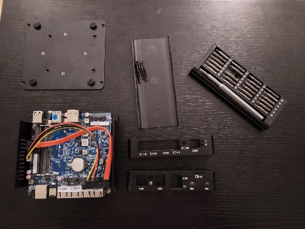

It's just 4 long screws that hold the faceplate and backplate onto the device itself, which provides great access to all components.  Rather interestingly, the device is technically upside down in this picture as the CPU sits on top of the device for heat dissipation.  It also means that rather amusingly, all of the ports are upside down when you want to plug stuff into it.  I should also say that I did pull the board off the top cover by unscrewing the 4 screws you can see in the corner of the picture, and the thermal paste application is... not the best (although I did leave mine like this and though the CPU runs warm, it's not boiling).  Finally, the computer itself feels really solid once it's together, which makes sense as it's made of metal.  You also get a power supply and 4 screws for attaching an SSD to the bottom plate (you can see the holes for this in the photo above) as well as a combined SATA and power cable.

There was one big issue with the device though, which is that it won't fit all the components inside it once built due to cables:

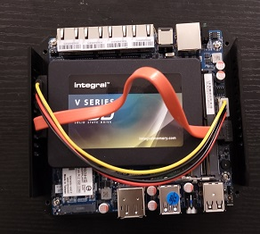

You might be able to force it, but I didn't want to as I felt that would be even more detrimental to it's lifespan, so I just ended up not putting the backplate on and leaving the SSD to run out the back:

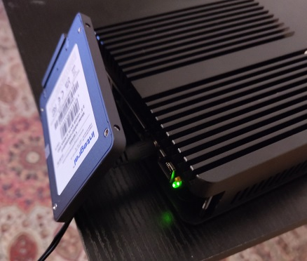

I'm not 100% happy with what I had to do, but given this drive is redundant anyway (and it wasn't that expensive), I'm not too bothered by it.  Additionally, it looks like there was supposed to be a factory cutout (you can see it in the review above) that would let you lead SSD out of the case better, but my unit didn't have it.  It's also pretty difficult to get the SSD SATA cable out once it's in place as it's really tight around that part of the board.

### Switch

The switch was actually surprisingly complicated to shop for, initially I was just going to grab a random cheap used switch off ebay as these things last for a really long time, and if it's cheap and doesn't take much to setup, I don't mind replacing it.  I did end ujp buying a cheap switch off ebay but it took a lot more research than I was expecting.  To start off with, if you're planning to have VLAN's you need a managed (sometimes called smart) switch and these can be expensive if you don't buy used and want more than 8 ports.  I wanted at least 16 so I had an easily expandable network ready to go.

After that you need to look at how fast it is, this is usually denoted by numbers like 10/100/1000 which means it is capable of doing 10mbps, 100mbps and also 1000mbps.  This was pretty what I was looking at, but it was exceedingly common to find 10/100 switch deals for super cheap - this was the reason.  Finally, you need to look the port types because there was a fair number of switches which could do 10/100/1000 but the 1gbps was through SFP ports rather than RJ-45, and on top of not fitting many devices directly, most of these switches only had 2 SFP ports, meaning it was essentially a 10/100 switch.

I ended up getting a NetGear GS724T 24 V3 network switch, which was most importantly, fanless for about £38:

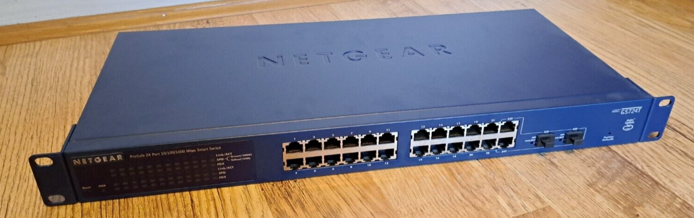

THis isn't my switch, I forgot to take a picture of it and I can't be bothered to pull it out of the rat's nest now.  It's absolutely the weak point of my network, but I only have a max speed of 350mbps for my internet and I'm not running anything which is bandwidth intensive, so it works for me.

### Access point

In terms of access points I wanted the following features:

- at least WiFi 6
- Supports a minimum of 4 SSID's for supporting multiple VLAN's
- ability to choose whether as network was 2.5GHz or 5Ghz
- preferably mesh for the greater ability to expand
- supports at least 100 client devices

I think when I was looking at this, there is lot's of choice in the market, which is well outside the scope of this article, but mainly what I was looking for was an access point that fit within my budget and had the features I wanted.  As I wasn't looking for specific brand, I pretty much just looked for what was on sale at the time I was buying.  When I first looked, the "best" option I could find was a tp-link EAP660 or EAP670 but decided to leave it a couple of weeks as I was still waiting to the router to arrive.  At the point it was shipped, the sales had moved on, and I was beginning to look at the NetGear WAX620.  However, I decided to sleep on it and the next day saw Ubiquiti was having a (small) sale, so ended picking up a U6 pro:

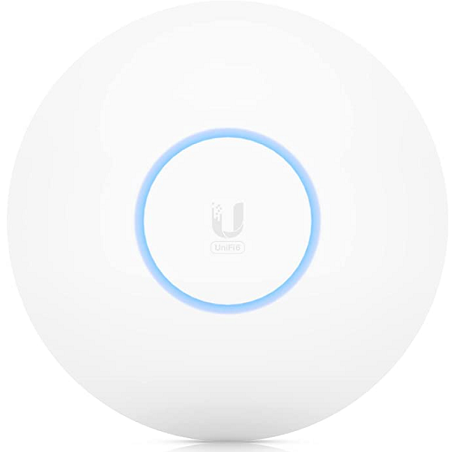

There is a load of discussion online about how this was a pretty suboptimal choice as a pair of U6 lite's will outdo a single U6 pro and for any application I could think to throw at it, a U6 LR would work the exact same for cheaper.  However, even my ISP provided router has the WiFi range for all of my small house (excepting the garden) so I only really wanted a single access point. Given the sale this access point was within budget, so I thought might as well.  All told, it cost me about £165.  Additionally, this is a PoE only access point, and as my switch is not PoE I also bought a PoE injector that cost about £10 to go with it.  If I get a few more access points, I'll probably invest in a PoE switch.

Picking this access point did mean I'd need to depend on the Ubiquiti Unifi software for provisioning and maintenance, but I wasn't too bothered for a single device as it's fairly lightweight and due to some other reasons I'll get into later.

### Ending notes

As I said at the top of this, I'm not an expert and there's going to be better options you could choose, but from what I could see, this worked for me and having lived with it in the house for a while now it all seems to work fine.

## Software

So we've gone through all the hardware I used now, so it's time to look at the software.  This is probably the bit I was most excited to get into as it was the bit I got to learn a lot on. This was also after the point I'd made all the hardware, which was actually a lot more stressful as there's always the worry you spent far too much money on a fancy paperweight.

### pfsense vs OPNsense

As I'd mentioned earlier I had 2 main choices of software to run on the router, either pfsense or OPNsense.  While getting into the history of this software is outside the scope of the document, the cliff notes are that OPNsense split (not very amicably) from the pfsense codebase in about 2014.  Both of them run on a form of the BSD operating system, and given the shared codebase share a lot of similarities.  However, it's generally thought that pfsense tends to bill itself for stability (though it definitely shouldn't be said that OPNsense is *unstable*), whereas OPNsense tends to move a bit faster on feature rollout.

Honestly, I was initially planning to run pfsense as the stability I'd heard about but pretty much instantly ran into issues as I alluded to earlier.  Essentially, I'd gotten pfsense 2.6 CE installed, everything on the install worked fine and when I booted up for the first time, got `network card unavailable`.  After some frantic googling to see what was going on, I discovered the Intel I226-V NIC which came with the computer was too new for pfsense to have enabled it in the mainline code branch (and by new, the NIC was released in about May 2022 and it was February 2023 I was working on this).  Now, there are workarounds which I'll discuss below, but I ultimately decided the weren't worth it and just ended up installing OPNsense, which worked first time.

So for workarounds, it's important to understand that there are 2 versions pfsense, an open source community edition and a closed source plus edition.  Currently in order to get your hands on pfsense plus, you need to "buy" a free license off the NetGate website.  At the time I was building out the router, pfsense plus 23 was in beta (and has now fully released), which did have full support for the I226-v.  However, in order to get pfsense plus you need to install the community edition and then upgrade from the web console. I couldn't do this as the software refused to run without a network card.  There are other workarounds on top of this which I could have done, such as sticking a hard drive in another computer, install and update on that and put that in the computer.  Alternatively, I could have tried installing a development build, which does have support for an I226-v.  However, by this point I was just frustrated by the process and had a perfectly good alternative, so I just decided to use that instead.  I should state, this is almost definitely going to be fixed soon.

### Gamebreakers

Both pfsense and OPNsense are incredibly powerful pieces of software which give you al ot of control and they don't hold your hand through the process.  This is just a section describing issues where I ended up just reinstalling as I'd screwed up hard enough to break something fundamental.  Rather embarrassingly, this did happen to me once where I wasn't paying attention during initial setup and set the LAN subnet mask to /32 instead of /24.  For people who like me, didn't know what I'd done at the time, I'd basically instructed the router that my LAN had 1 ip address and therefore couldn't connect with anything else (such as the device I was using to configure pfsense with).  While I could have probably figured this out without a reinstall by plugging the router into a monitor and going through it directly, I was only 5 minutes into the install and just decided to spend 10 minutes doing a reinstall rather than muddle about a bunch of config files to fix it directly.

### Install

For the install, I mainly used 2 of the guides I posted above.  Both of them actually hit pretty similar points and while NGUVU guide is for pfsense, there are enough similarities between pfsense and OPNsense, it was usually possible to figure out what was going on after a quick google search.  I'm going to break this section down into the rough points I had to follow, which are as follows:

- VLAN/subnet overview
- network setup
- install
- wizard
- initial setup
- interface assignment
- DHCP setup
- VPN setup
- gateway setup
- DNS setup
- define aliases and groups
- outbound NAT setup
- firewall rules
- verification

### VLAN overview

I went VLAN's over subnets as I didn't want to run multiple routers and from what I can tell, this is the difference between them.

I decided to go with 5 VLAN's, which was basically the 4 that both guides discuss, plus an extra one for IOT, which currently has my various smart devices on it:

- management
  - used for managing the network and allows SSH into the router
- VPN
  - All traffic through this endpoint is passed through a VPN and has ad-blocking
- clearnet
  - This VLAN is a pretty basic one that just allows access ti the internet. I use this mainly for devices like my work laptop so that the VPN my company uses isn't impacted
- guest
  - Used for guest devices and specifically disables any access to devices in my network
- IOT
  - Has all of my IOT, networked and transient devices on it.  Currently it also has a VPN and ad-block but I'm assessing this as I go forward

This probably more for the AdGuard section, but the IOT VLAN pretty much follows the VPN settings for now, but I'll likely review later.  It's definitely been useful, as I can already see I'm blocking some trackers coming from my smart speakers, which I previously couldn't do. NOTE: doing this can degrade your service, so I'm currently assessing whether using these blocklists has broken anything:

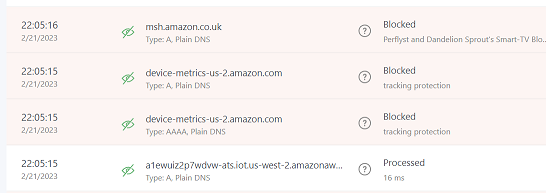

### Network Setup

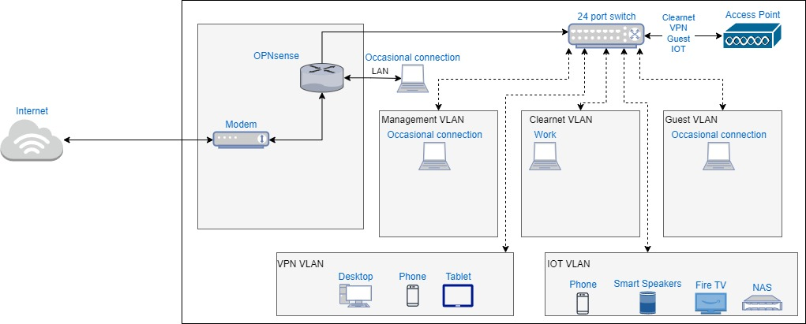

The phone is on there twice, as I tend to move between the VPN and IOT VLAN depending on my needs.  I also only put devices on my LAN, management VLAN and guest VLAN if I'm troubleshooting or have a specific need.

### Software Install

I did get to the point of install for both pfsense and OPNsense.  The install process was the exact same.  YOu essentially use Balena etcher to create a bootable USB stick and then run from that USB.  Once the process starts you can choose a keyboard language, then select the storage type and the hard drives you want to use. Finally, you can setup a root user.  Once this is done, the router should reboot and go through some preliminary checks.

### Wizard

Once the install is done, you need to plug the router into the modem and a computer into another port on the NIC. At this point I left my router hooked up to a monitor just to see if it's correctly assigning thew WAN and LAN ports. Then you can use the computer to connect to the router using a browser, by going to 192.168.0.1 and you should be met with a screen like this:

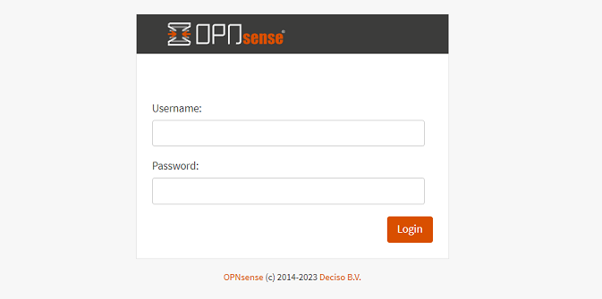

you can login with the username root and the password you'd previously set.

At this point you can go straight to the wizard to get started, but I don't like to be logged in as root, so I setup a user to administrate the network immediately by going to System > Access > Users and clicking on the small orange cross.  You will need to set the user for shell access by moving away from the /sbin/nologin login shell and adding the user to the admin group:

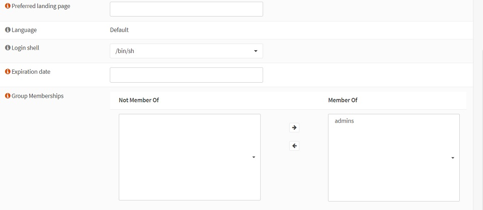

Once you save the user you can now just login with them and stop using root.

What I did like with the wizard, is that by setting the hostname and domain, OPNsense will automatically set things up so you can access the router using these values.  For example, if you leave the hostname as default and change the domain to love.cheese, you will be able to access the router from the browser by going to OPNsense.love.cheese instead of the ip address.  I've seen this before, but usually you need to mess around with the hosts file to get it to work, so I liked it doing it for me.

*NOTE:* It's probably a good idea to check for updates to make sure everything is up to date by going to System > Firmware > Status > Check for updates - this could save you some hassle further down the line.

## Initial setup

Both the guides seem to work by disabling IPv6, which I might want to revisit at a later time, but for now it definitely feels like an unnecessary complication when I'm already tying to learn a lot for this.

## Interface assignment

This is the point the VLAN's are setup.  However, before I get to that I at least want to put out that it's a good idea to figure out which port is which on your NIC.  If you have the same NIC I do, it will look something like this:

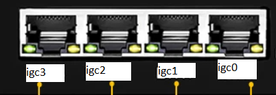

Note, the ports are backwards as the entire computer is fitted into the case upside down.  The computer does label these ports albeit incorrectly as they are labelled with ETH instead of igc.

Within this, when I first setup the router, igc0 was automatically assigned to my LAN port and igc1 was assigned as my WAN port based on what I had plugged into them.  I'm going to assign all of my VLAN's to go through the igc2 port and leave igc3 free for the moment in case I want to expand further later.  Given this port is a 2.5Gbe port, I might put an access point on it in the future, but for now everything is going via the switch.  Additionally, leaving the LAN port around is so that I can directly access the router if I screw something up on the switch in the future.

The VLAN numbers are important as well for future reference as they form the final part of the network in an IP address.  For example, a VLAN with an id of 40 will place all devices on `*.*.40.*`

One of the things I did find useful later on, was the ARP table in interfaces > diagnostics as it shows you all devices currently connected and you can also set it so it brings back the hostname of the connected devices, making it easier to see what's connected where.

### DHCP setup

Both guides recommend setting the DHCP so that 100 to 199 dynamically assign an IP address.  I saw no reason why I would mess with this (especially as I'm new to this) so I just left it all as it was.

### VPN

It's a little outside the scope of this article, but there are essentially 2 forms of VPN protocol you can use in OPNsense for a network wide VPN, this is openVPN and Wireguard.  The difference between these 2 is that openVPN came first and is widely supported.  ON the other hand, Wireguard is much newer but lot lighter weight (and therefore faster).  Basically, you're currently choosing between stability and speed.  Additionally, in OPNsense openVPN is installed out of the box, whereas Wireguard needs to be added as a plugin.  I think I made a mistake here and decided to go with openVPN to start with as it was built-in to the software and the guide I was following used openVPN, so my thinking was that there would be less chance of errors if I move between versions of OPNsense.  However, after reading up a bit further, this seems a bit conservative on my part and the additional speed would be nice.

In terms of building out the VPN connection, I have NordVPN as my provider, rather than mullvad or AirVPN.  So for this, I pretty much followed the guide handed out by the NordVPN team which is available [here](https://support.nordvpn.com/Connectivity/Router/1292598142/OPNsense-19-1-setup-with-NordVPN.htm).  Later on I did make some small changes to support the VLAN config as well, as the guide by NordVPN uses the LAN connection.  While building this out, I did come across 2 issues.  The first was I'd removed the default DNS servers setup in the wizard when I was testing the DNS was working correctly, but this appears to break openVPN (maybe just NordVPN?) as the VPN gateway never comes up.  The next thing I came across, is make sure you have all the firewall rules applied correctly, I specifically had issues around mapping a VLAN net to a VLAN address as this doesn't look like this can be done through groups (more on groups later) and has to be done directly on each interface.

### Gateway setup

Not much to talk about here, but I'm thinking to add a second openVPN gateway in so I can have redundant failover.  This is because currently, I don't really have a way to tell if the VPN gateway has gone down.

### DNS setup

Within OPNsense, the DNS forwarder is called DNSmasq and the DNS resolver is called Unbound.  The difference between these types of DNS settings is outside the scope of this guide, but you can read about them [here](https://serverfault.com/questions/1060543/dns-forwarder-vs-dns-resolver). I do think I went a little overboard with this setup, but this is what I believe is happening in my network now:

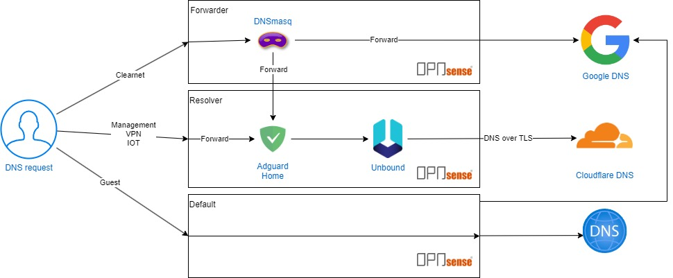

One of the differences between my DNS settings and the Schnerring guide, is that I couldn't find DNS servers on the DHCP settings for my guest VLAN, and to be honest I didn't really mind just reusing the overall DNS that was setup for the router.  I ended up just leaving it to use the default DNS I'd setup, which was the google DNS.

Initially, I also left out the Adguard Home and just talked directly to Unbound as I wanted to keep it as close as possible to the guide as I was setting.  Afterwards, I discovered it was easy enough to set this up, as well as enable DNS over TLS.

### Define aliases and groups

This was really nice to see, as I could define groups of VLAN's, so that I didn't have to repeat myself when I was setting up firewall rules.  Additionally, I setup the default aliases, but ending up having to expand the allowed ports for my NAS later on.

### Firewall rules

When you're on this step, it was extremely helpful for me to have the live view of my firewall logs sat next to me so I could tell what was going on where.  You can find this in firewall > log files > live view.  In terms of the rules I actually set, I pretty much just followed the guides.  I might come back to this later, especially around my IOT VLAN as I would like that to be really secure.  However, it's probably worth noting that the setup I now have is a lot more secure than before when all I had was my ISP provided router.

### Verification

While I was doing verification, I didn't actually have a spare computer outside of the one I was using to do the install.  I could have used my desktop but it would have meant traipsing around the house to move between all the VLAN's.  I did find a workaround to this, which is that you can pass VLAN's through a single Intel ethernet port using the Intel PROSet drivers and device manager:

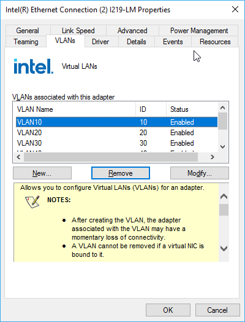

This was a little annoying to figure out, mainly around trying to get the right PROSet drivers that would enable the VLAN tab for the NIC in my system, but once I got them it was straightforward enough to update the drivers through device manager.  When you create a VLAN in the PROSet drivers, it automatically creates a separate network interface for every VLAN that you can use.  This also meant that I could isolate the network from my switch configuration, and verify everything worked before plugging my router into the switch.

At this point, I created an Ubuntu virtual machine in VirtualBox, got it booted up and installed, then shut down.  You can then set the correct network adapter that you want by going to the network tab of VirtualBox for the virtual machine in the settings.

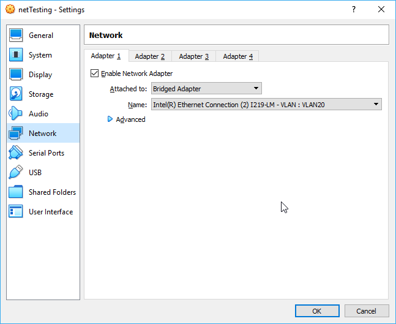

Overall, this process probably took me 3 hours, to save 10 minutes of walking up and down the stairs - time well spent as always!

At this point you can just run the resolvectl command and I can see I'm talking to the DNS server I wanted to (i.e.: my router):
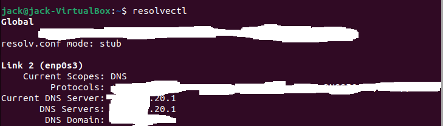

At this point, I just ran through all the commands listed in the guides to verify I was seeing the same thing, and it was definitely interesting (and amusing) to see that when you used a dig command with a DNS, I could see that the resolve was actually happening via the DNS I wanted, rather than the one selected, which you can see happening in the firewall logs.

I also checked on my VPN endpoints that the VPN was working by going to the NordVPN website and seeing that the banner at the top said I was protected:

### Further steps

This is the point the initial guides ended, but I wanted to go a step further and install Adguard Home and automated backups of the config.

For Adguard home, I used a combination of [0x2142](https://0x2142.com/how-to-set-up-adguard-on-opnsense/) guide linked above, which shows you how to add the community plugins repository and Adguard Home. This guide does have Adguard Home set behind Unbound, and I wanted to do it the other way around, so I modified the instructions slightly using [this guide](https://forum.opnsense.org/index.php?topic=22162.msg146626#msg146626) I did slightly screw up the config here, in that I setup Adguard Home on port 80, meaning that on http I get the Adguard service, and on https I get the router console.  It's not too much of a big deal, and fairly straightforward to sort out, but I'm ok with it for the moment as the only person who should be modifying this stuff is me.

After I spent some time finding some lists to block for trackers and ads, I ended up going to the [d3ward](https://d3ward.github.io/toolz/adblock.html) adblock tester and got the following results:

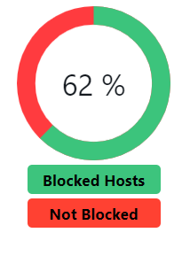

Not perfect, but good enough for me as this level is about what I could get without blocking entire websites.  For example, while I'm not a fan of AMP links, if you have them blocked, it basically disables the entire news panel on my phone.

Setting up backups is pretty easy, just go to system > configuration > backups .  You can download a snapshot, but I decided to use Google Drive as it's basically free to do and means I don't need to think about it.  The OPNsense documentation on this is really good and it's found [here](https://docs.opnsense.org/manual/how-tos/cloud_backup.html)

### Switch setup

Fortunately for me, NGUVU also had a guide for a very similar NetGear switch (found [here](https://nguvu.org/pfsense/pfsense-router-on-a-stick-with-netgear-gs108/)) that was pretty simple to follow.  There was also a guide for a MicroTik and Cisco switch.  Ultimately though, my understanding of the process is as follows:

- add the VLAN's to the switch
- remove the default VLAN (usually has an id of 1) from all the ports you want to use
  - don't remove them all, as this can disable you from accessing the switch (as I found out)
- set the port that leads into your router as tagged on all VLAN's
- set all the ports that you want as direct ethernet connections as untagged with the VLAN you want on that port
- on the access point ports, set all the VLAN's you want passed to that access point as tagged

### Access point setup

Given I was using a Ubiquiti access point, I did initially try and set it up using my phone, but I couldn't get it to connect properly, likely because it was plugged into a third party switch with multiple VLAN's, so I gave up after as while and just used the the Unifi network software, which found the access point immediately.  After this I just added each VLAN to an individual SSID in the controller and everything just started working.  If you want, you can *also* run the Unifi software directly on an OPNsense router as a plugin, if you have the community repository setup.

## Final network

It is absolutely a bit of a rats nest, but I live alone so I don't care and it's also partially hidden by a chair you can't see.  My next purchase is probably a rack to hold it all (maybe a [LackRack](https://wiki.eth0.nl/index.php/LackRack)) and maybe a UPS.

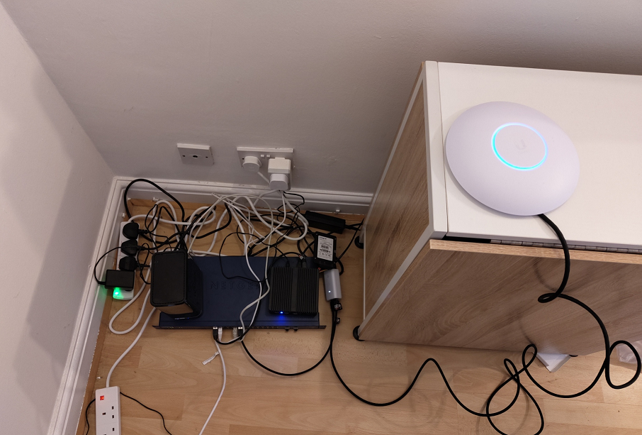

## What's next?

I'm not really sure, right now everything's working fine and I'm busy asserting dominance on the neighbourhood with my multiple wireless networks.  I am planning to buy or build a server at some point in the future so that I can start a home lab that I can use to mess around with all the bits and pieces of software I find interesting.  There's also a bit of a long term goal of setting up access points that reach out across the garden, but it's not urgent.

## General notes

I spent far more time thinking about this project than actually doing it.  However, it's seriously helped my understanding of networks and I think I'll probably be using some of the stuff I learnt in my job as it's given me a better feel into how this stuff works as a home user on top of what I already knew from working with AWS and the rest of my career.
