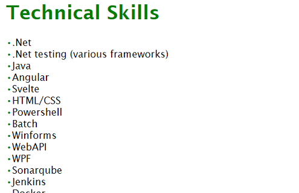
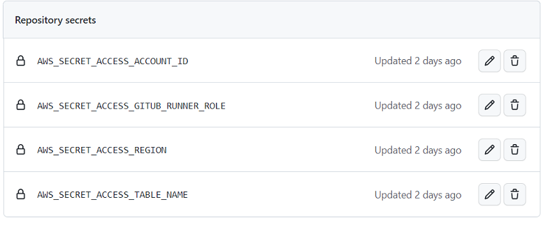

## Background

Back in January I'd made a promise to myself to spend at least a little bit of time doing something technical every week, whether that be writing software, building out hardware or just generally reading something to try and keep my skills up.  To start with I was going to try and complete code [kata's](https://t2informatik.de/en/smartpedia/code-kata/) in a few languages I wasn't too familiar with such as python.  However, I quickly found that I just find writing code with no payoff to be not that interesting to me, so I was looking for something a bit different.  As a result I'd been looking around the internet for something technical to do and came across the [AWS purity test](https://www.awspuritytest.com/) which I did as a bit of fun as I work with AWS pretty heavily in my day job.  One of the questions on the test was talking about completion of the [cloud resume challenge](https://cloudresumechallenge.dev/) and while I'm not in the market for a new job it sounded like a really interesting project to tie all my skills together and given I was already trying to find something that wasn't driving me to tears with boredom I thought might as well try it.  3 weeks later I've got the following:


Impressive right? No not really, but to be fair it's a resume so it's supposed to be simple and most of the interesting stuff in this project is pretty much all behind the scenes.

If you're interested in viewing the website itself it's [here](https://resume.jacklewis.dev/)

Slightly more impressive, I think is this diagram of the end product:


## What's the challenge?

Put simply, it's a series of 16 steps to build and host a static website in your cloud of choice, then pull some data in from a database.  You also need set up a fully automated deployment of both the backend and frontend using infrastructure as code.  Once you've done all this, you then need to post a writeup about it somewhere online with tips and tricks and your experiences of doing the challenge. Additionally, there's a discord you can use if you have questions, but I intentionally avoided this as I wanted to see if I could do this on my own.  If you're thinking of doing the challenge, it might be best to stop here if you want to avoid some spoilers, otherwise let's go through it!

## Final outcome

Thought I'd put this at the top so it doesn't get lost, but there are essentially 4 outcomes for this project:

- [Resume Project website](https://resume.jacklewis.dev/)
- [Frontend code](https://github.com/jlewis92/ResumeProject-frontend)
- [Backend code](https://github.com/jlewis92/ResumeProject-backend)
- [Dev.to article repository](https://github.com/jlewis92/DevToArticleRepo)

## Timeline

This project was completed on a vague timescale of the below.  I wasn't really working on this full time at the start, just a few hours a week but I did a fair amount the last week of this project

- week 1: HTML/CSS and cloud front hosting
- week 2: JavaScript, database, API and python
- week 3: everything else

## Dev environment

I pretty much used vscode to write everything as I've used it pretty heavily previously.  In terms of some of the extensions I'm using they are:

- [Live Server](https://marketplace.visualstudio.com/items?itemName=ritwickdey.LiveServer)
  - Allows you to quickly run and host a simple HTML website and reloads on changes automatically

## Certification

The guide recommends you have a [cloud practitioner's certification](https://aws.amazon.com/certification/certified-cloud-practitioner/) before starting the challenge.  I don't personally have one of these, mainly because I've been working with AWS in industry anyway so most of the things it's talking about I have a vague idea on anyway.  However, if you're coming into this with no experience whatsoever it's probably a decent way of understanding how AWS works without fumbling blindly

## HTML

It should be said that the frontend wasn't really the focus of this project so there's not really much to talk about here, I just wrote a simple template in HTML which I could use to put data in.  Given this was supposed to be simple, I'm just directly writing text into the file but if I was actually doing this in a production environment that would definitely not be the case.

## CSS

It has been a fair few years since I've written purely in HTML/CSS without something like bootstrap or tailwind to make life easier for me, but I think I did an ok job, some of the slightly more interesting things I did were using media queries to set styling based on screen width so it would be a bit more useful for mobiles:

```css
 @media only screen and (min-width: 1000px) {
    .resume-body-skills-wrapper {
        column-width: 250px;
        resize: none;
    }
 }
```

This then does the following with the skills section on the resume:




One of the interesting thing's I did find was that you can use css to do stuff when certain tags are sat next to each other, like the following:

```css
span+span {
    margin-left: 50px;
    /* adds in 50 px spacing when there's a double span tag */
}
```

### Both

Generally, I've worked much more heavily WPF when building frontends which uses XAML.  I think as an observation between the 2, I've found that it's probably easier to place your content where you want it to go with XAML (I tend to not find my self googling how to centre content anyway!) but actually styling elements within XAML is much harder.

## AWS setup

If you've never setup an AWS account before, it's pretty straight forward, just go [here](https://aws.amazon.com/) and give AWS your credit card number.  While outside the scope of this article, it's pretty much mandatory for me that you complete all of the security recommendations in IAM before starting as well as enabling MFA everywhere.  You should also download the AWS CLI and setup credentials using aws configure:

```python
$ aws configure
AWS Access Key ID [None]: key ID
AWS Secret Access Key [None]: access key
Default region name [None]: region
Default output format [None]: json or yaml
```

If you've also setup MFA everywhere you might also need to use the `sts get-session-token` CLI function as well.  AWS recommends you use the toolkit instead but I've tended to find it didn't work very well when I was using it for work last year.  You should also setup billing alerts on your account, because [unexpected bills are terrible](https://www.reddit.com/r/aws/comments/lbqcos/my_forgotten_account_has_a_20000_bill_how_screwed/)

## Static Website

This is really easy to do, you just go to S3 give it a name and ignore all the warnings it gives you when you untick block all public access:


At this point, all you need to do is upload your website files, then go to properties -> static website permissions and tell it what the index document of your website is.  At this point, all you need to do is select the link S3 gives you and you should see your website on a random http url.  At this point you're done! Well, not really, if all you wanted to do was host your resume, that's it unfortunately we're not even halfway through if you want to complete the actual challenge. [S3 pricing](https://aws.amazon.com/s3/pricing/) is pretty negligible for this project as I'm storing under 1MB and AWS charges about 2 cents per GB per month

## DNS

Technically, HTTPS comes before this step, but CloudFront offers a lot of automation if you have this up beforehand.  The guide recommends using using Route 53 but I'm not a massive fan as the interface is pretty old school, and even though I've set my account into GBP, it's still showing me prices in dollars. Finally, it also doesn't have the .dev top level domain that I want, possibly because Google operates it:


I specifically wanted .dev as it matches what I do and also comes with added bonus of forcing HTTPS, meaning if I want this to work it needs to have certificates setup properly. For this domain to buy it off [Google Domains](https://domains.google.com/registrar/search) and set it to auto renew

Only real change to this is that I had to use google domains and then [transfer](https://www.entechlog.com/blog/aws/connect-google-domain-to-aws-route-53/) it to Route 53.  This is the point where you're going to incur a small monthly fee as [pricing for Route 53](https://aws.amazon.com/route53/pricing/) charges 50p per month per hosted zone, then a further 40p for every 1 million requests.

## HTTPS

Really, this section should be called the CloudFront section of the guide as it's basically what you're going to do here.  I wasn't a massive fan of this section as pretty much the website link that the AWS resume challenge for this basically does everything for you and when I'm trying to learn, I'd much prefer this to be a bit more separated out.

### CloudFormation

To start with , you're pretty much going to go to the [link](https://aws.amazon.com/blogs/networking-and-content-delivery/amazon-s3-amazon-cloudfront-a-match-made-in-the-cloud/) in the AWS resume challenge and then choose stack 3 and filling out the questions it asks you.  This wasn't a great experience for figuring out how it works as the CloudFormation template is pretty obtuse, given it calls out to other scripts within it, and the CloudFormation designer UI is pretty cluttered and difficult to see what's going on:


As you can see, the entire section of the template showing how the ACM stuff works is just being pulled in from another template. Also, if you drag the designer around, your location in the template gets reset to the top which is really annoying.  However, I did like that the template made it super easy to set the subdomain to "resume" instead of "www" as I'm planning to host a more modern website on that subdomain at some point in the future.

### CloudFront

Once you've gotten you're template done and waited the 20 minutes for everything to get setup for you, all you need to do is throw your website into the bucket the template generated and watch as your site is served! Well, with a caveat - because CloudFront is using edge locations to serve your content as close to the geographical location of the caller as it can, it basically has to distribute these to  the servers around the world and cache them.  As a result, it can take up to 2 days for content to be displayed throughout the world.  Once you've realised this, you can take advantage of CloudFront [invalidations](https://docs.aws.amazon.com/AmazonCloudFront/latest/DeveloperGuide/Invalidation.html) to force the cache to refresh.  The [pricing](https://aws.amazon.com/cloudfront/pricing/) for this is that you get 1000 free invalidations per month, and if you want to refresh the entire website you can use `/*` or for individual files you can use `/<file name>.<file name type>` and list the specific ones you want.  You also need to pay for edge computing, but currently my bill is sat at £0.

As a sidenote, the CloudFormation template does generate logs into an S3 bucket without rotation.  For now I've left them on as it's pretty small amounts of data, but I've still set a lifecycle retention policy on the logs folder just in case.  You can also set alerts around stuff like number alerts over a time period or data the rate for upload and download among other things.  You can also get some metrics around the website, such as usage:


Or viewers:


**_NOTE:_** one of the big errors I had around the CloudFormation template was around how it basically disables javascript from running by setting the Content Security Policy to deny everything in the AWS Role that it generates, as I'd missed this when I first went through it, it caused me a lot issues later on.

## JavaScript

This part of the challenge is to create a visitor counter that's updated via JavaScript

I think this is the first time I've worked fully with vanilla JavaScript before as I normally use TypeScript or some sort of framework.  However, there's really not much to speak about on it as it's less than 10 lines long. All it's doing is getting some text from an API and then setting a visitor counter on the footer to that value.  I can say I much prefer using frameworks which let me set values using `{braces}` rather than having to use the document query selector.

## DynamoDb

I've used dynamo pretty heavily before so I'm pretty much using this to brush up on this again.  For myself, while you can write tables straight into AWS, I find it's much easier to visualise and work on tables using an offline tool called [NoSql Workbench](https://docs.aws.amazon.com/amazondynamodb/latest/developerguide/workbench.html).  If you want to use DynamoDb offline is to just set the toggle for DDB Local server and publish a table into a local connection and it's now setup for you:


Once this is setup, all you need to do in order to use DynamoDb local is attach an endpoint url when you create a client for DynamoDb.  If you haven't changed the default port for DynamoDb, it will look something like this in Python - `endpoint_url="http://localhost:8000"`.

However, the best thing about NoSql Workbench is it's ability to do your work for you by generating code directly using the operation builder:


The expression above basically increments the VisitorCount column by 1 and if I hit the generate code button, it basically gives me the code to do this in Python, JavaScript or Java.

I quite enjoy working with DynamoDb and always have done as I find it's really quick to get going in development.  There is a fairly large learning curve if you're coming SQL databases as the single table design and replication of data can be a little mind-bending.  There are some pitfalls to be aware of, for example retrieving ALL the data out of a table is considered a bad idea because of how much it can cost.

## Lambda

This section comes after the API in the cloud resume challenge document, but I find it's usually easier to write the code that retrieves data from the database, before you build out the API calls.  In this case, I'm writing an AWS lambda expression in Python.  I'm using Python as I've previously written lambda expressions in C# and I thought the best thing to do for this point was to work in a language I've only had a little experience of.

I did spend more time than I was expecting on this section of the project though...

I'm pretty happy with Python as a language as it's easy to see what's going and at least in small scripts the lack of compilation speeds up development.  However, I think I do still prefer C# to write Lambda expressions in and just general development.  This is almost entirely due to not the language itself and more the tooling surrounding the language in Windows (I'm aware this is different in Linux) as I'm feeling like I'm constantly fighting it during initial setup.  For example, while sure nowadays if you type Python into PowerShell, it just opens up a Windows store window which allows you to get hold of Pip and Python quickly, what it doesn't do, is setup the scripts folder on your PATH, which led to issues when I was using the [Python lambda local](https://pypi.org/project/python-lambda-local/) library to test the AWS lambda expressions. Then of course there's messing around with venvs in vscode.

However, I did manage to eventually get everything up and running, using some slightly modified code from NoSql workbench which would allow it to return the data in the same call to update the database. I think the code is pretty good as it runs in under a second on AWS Lambda.  Given lambda [pricing](https://aws.amazon.com/lambda/pricing/) gives you over 800 hours free per month at 128Mb, I think this is fine.

Here's the full request for updating and returning a value for the visitor counter in DynamoDb:

```python
def create_update_item_input(table_name: str):
    return {
        "TableName": table_name,
        "Key": {
            "PK": {"S":"resumeProject"}
        },
        "UpdateExpression": "SET #visitorCount = #visitorCount + :increment",
        "ExpressionAttributeNames": {"#visitorCount":"VisitorCount"},
        "ExpressionAttributeValues": {":increment": {"N":"1"}},
        "ReturnValues":"UPDATED_NEW"
    }
```

If you want, here's a direct [link to the full source code](https://github.com/jlewis92/ResumeProject-backend/blob/main/python/UpdateVisitorCount.py)

## Tests

Once I got this all done I moved onto writing some tests.  I just decided to keep simple and use the `unittest` library that's built into Python.  I then found that there's a pretty great mocking library for the AWS boto3 client called [moto](https://pypi.org/project/moto/) that can be used to write proper tests for Python.  Compared to C# this is great, as my only option there appears to be writing wrapper classes that call the function.  To be honest though, this is where I spent a lot of my time as I ended encountering a bug in moto that I ended up making an [issue](https://github.com/getmoto/moto/issues/5916) on GitHub about.  Fortunately, the people running the moto repo responded quickly and it's been fixed - all I need to do now is update my tests to work with the fixes!

## API

The API is built using API gateway that has a lambda proxy integration to the lambda expression I'd built in the previous step and returns data to the client like this:


I decided to just return a string because it was easy that way.  If I was to extend this and have more than a single value returned to the client I'd change this to JSON as it's much nicer handing data between server and client.  However, this was such a small part of the project I just decided not to do it. I understand it's not a great idea though as my website just returns whatever the result of the fetch is, I'm just lazy and had spent far too much time on this already.  I should also say I'm a bit iffy about leaving a lambda gateway open as I usually stick them behind a cognito pool or oauth authoriser whenever I've used an API from API gateway in the past.

Just as a sidenote however, if you're doing a lambda proxy in the gateway, the response returned by the lambda must be in the format as follows:

```json
{
    "statusCode": "200",
    "body": "body",
    "headers": "headers"
}
```

Once I got this all hooked up, I just updated the javascript to pull in from the backend and I can now see my visitor counter is updating:


Although no it wasn't initially, as I needed add CORS headers to the request to get it to display content.  Technically, I could have just hosted it on an endpoint within jacklewis.dev, but I wanted to try adding headers directly instead. I'll talk about how I did that in the next step.

## Infrastructure as Code

For this I used Terraform for the backend as I've used it a little bit before.  It's a pretty great tool for describing resources in AWS and has the benefit of being cross-platform as opposed to the AWS SAM model first pointed out the the cloud resume challenge website.  I should probably note as well, that most of the stuff I did build directly via the console to check my understanding, before translating it into Terraform. I like to style Terraform by having not much in the `main.tf` file and then linking each file to it's purpose.  As a result the structure for the Terraform ended up like this:

```markdown
├── api-gateway.tf
├── dynamo.tf
├── github-runner.tf
├── iam.tf
├── lambda.tf
├── main.tf
└── provider.tf
```

The Terraform is setup to use variables for everything which I don't people to have access to, such as my account id.  These values are injected into the Terraform .env file that I get to run locally using the [Terminal.env](https://marketplace.visualstudio.com/items?itemName=hzeineddine.terminal-dotenv) extension to make it easier to pull these values in when I want to run the Terraform.

I'm going to talk through each of these files individually (outside of main and provider) as they all have interesting features

### API Gateway

Within this `.tf` file I've got configuration entirely related to the single endpoint I've got in my gateway.  However, there is actually 2 endpoints i the repository, a POST which actually returns the data and an OPTIONS request which is used for CORS.  Unfortunately, the way to write Terraform for gateway is pretty verbose as there's quite a lot of steps to enable everything together.  I've split it all out though with headers to make it a little easier what each step is - for reference, it's basically having to setup all of these stages:


This particular request is taken from an example [here](https://codeburst.io/aws-api-gateway-by-example-3733d7792635) if you want to see how this was setup within the AWS console.

### DynamoDb Terraform

The interesting part for this is that I was using Terraform import commands to import existing resources in AWS into Terraform, so I don't need to recreate them and then delete the old one. Otherwise, the setup for this is pretty straightforward

### GitHub Runner Terraform

This was interesting in that AWS and GitHub have recently integrated the ability to use [OIDC](https://www.pingidentity.com/en/resources/identity-fundamentals/authentication-authorization-standards/openid-connect.html#:~:text=OpenID%20Connect%20(OIDC)%20is%20an,network%2C%20to%20authenticate%20their%20identities.) to run build jobs, which is a lot safer than just setting a secret access token as a secret on GitHub and hoping nobody steals it in the several years you don't touch it. How this works is that GitHub and AWS negotiate for a short-lived access token that can run stuff in your account via an AWS role you define.  I did purposely leave out defining a role for this account as I wanted to control access more directly via the AWS console as it's quite important.

### IAM Terraform

This is a pretty standard (and small) section which basically gives the AWS lambda expression access to the DynamoDb table and write logs about the output.

### Lambda Terraform

I've previously has lambda expressions written which are uploaded to S3 because keep track of versions was important, in this implementation though, I've got it to zip up and directly upload into a lambda expression.  However, what can do is set a source code hash like this:

```terraform
source_code_hash = data.archive_file.zip_the_python_code.output_base64sha256
```

Which means that the lambda will only be uploaded if there's been actual changes to the file.  I've also set a retention policy for AWS CloudWatch as it doesn't have this by default.

### Overall

I did quite enjoy writing the Terraform, it's interesting to work on something like this and really, there's nothing quite like just entering `terraform apply -auto-approve` and just watching everything get update for you.

## CI-CD Backend

The backend can be found [here](https://github.com/jlewis92/ResumeProject-backend)

So to start with I just setup a private GitHub repo (that I've since made public) and stick a Terraform and Python .gitignore file into it and the MIT licence.  After that I added some Git [pre-commits](https://pre-commit.com/) to do stuff like auto-format the Terraform scripts and check if I've left any secrets in plaintext on the repository.  I did get a false positive on the GitHub thumbprint for the OIDC token which is why it has `# pragma: allowlist secret` written next to it.

Once I'd done this I committed everything I had and it was time to work on the GitHub Actions project.  As the Terraform is using a load environment variables to run, I set this up as secrets on Actions so that they couldn't be seen in logs:



After this I wrote a pipeline which does the following:

- Install and cache dependencies
- Checkout the code
- Run the python tests
- Setup the OIDC tokens for GitHub
- Run a bunch of Terraform formatting tools and checks to make sure everything's good
- Apply the changes if the build is running on the main branch

I also got the build to output some nice content about Terraform in a pull request:


I should probably say, I work on builds pretty regularly so this stuff isn't that new to me

## CI-CD Frontend

The frontend can be found [here](https://github.com/jlewis92/ResumeProject-frontend)

The CI-CD for the frontend was simpler than the backend as it didn't have a load of Terraform to run, and it really just needs to sync with an S3 bucket and run an invalidation to force the changes to propagate.  Given there's a limit to the number of invalidations you can do before being charged, I did think about adding a rolling monthly limit, but ultimately decided there wasn't much point as I've used less than 20 of them out 1000 I get free every month.  I also added secrets needed by the github runner to get an OIDC token.

## Blog post

Well, this is what you're reading (if you managed to get to the end of my apparent essay on this topic)

I did decide though, that I'd also automate my ability to add blog posts to dev.to using GitHub.  I decided to be meta about it and published a blog post about how I did this [here](https://dev.to/jlewis92/my-setup-for-publishing-to-devto-using-github-1k0n) for practice.

## What's next

 I'm probably going to take a short break from this, but I did really enjoy it so I likely do more of this.  Interestingly, one of my next projects has just arrived so I'll probably working on that soon -  think it's good idea to write a post about it when I finish, as writing these articles was a good way to fix it into my mind.  I've also got a few other more further into the future projects - I'd like to write a homepage which is more reactive (pun possibly intended?) that I'd like to do at some point.

In terms of this project it's pretty much done just need to keep everything updated, write the proper Python tests with the updated library and likely run through and edit these posts.
