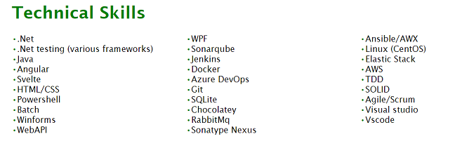

## Background

Back in January I'd made a promise to myself to spend at least a little bit of time doing something technical every week, whether that be writing software, building out hardware or just generally reading something to try and keep my skills up.  To start with I was going to try and complete code [kata's](https://t2informatik.de/en/smartpedia/code-kata/) in a few languages I wasn't too familiar with such as python.  However, I quickly found that I just find writing code with no payoff to be not that interesting to me, so I was looking for something a bit different.  As a result I'd been looking around the internet for something technical to do and came across the [AWS purity test](https://www.awspuritytest.com/) which I did as a bit of fun as I work with AWS pretty heavily in my day job.  One of the questions on the test was talking about completion of the [cloud resume challenge](https://cloudresumechallenge.dev/) and while I'm not in the market for a new job it sounded like a really interesting project to tie all my skills together and given I was already trying to find something that wasn't driving me to tears with boredom I thought might as well try it.  3 weeks later I've got the following:

<!--  -->

Impressive right? No not really, but to be fair it's a resume so it's supposed to be simple and most of the interesting stuff in this project is pretty much all behind the scenes.

If you're interested in viewing the website itself it's [here](https://resume.jacklewis.dev/)

## What's the challenge?

Put simply, it's a series of 16 steps to build and host a static website in your cloud of choice, then pull some data in from a database.  You also need set up a fully automated deployment of both the backend and frontend using infrastructure as code.  Once you've done all this, you then need to post a writeup about it somewhere online with tips and tricks and your experiences of doing the challenge. Additionally, there's a discord you can use if you have questions, but I intentionally avoided this as I wanted to see if I could do this on my own.  If you're thinking of doing the challenge, it might be best to stop here if you want to avoid some spoilers, otherwise let's go through it!

## Final outcome

Thought I'd put this at the top so it doesn't get lost, but there are essentially 4 outcomes for this project:

- [Resume Project website](https://resume.jacklewis.dev/)
- [Frontend code](https://github.com/jlewis92/ResumeProject-frontend)
- [Backend code](https://github.com/jlewis92/ResumeProject-backend)
- [Dev.to article repository](https://github.com/jlewis92/DevToArticleRepo)

## Timeline

This project was completed on a vague timescale of the below.  I wasn't really working on this full time at the start, just a few hours a week but I did a fair amount the last week of this project

- week 1: HTML/CSS and cloud front hosting
- week 2: javascript, database, API and python
- week 3: everything else

## Dev environment

I pretty much used vscode to write everything as I've used it pretty heavily previously.  In terms of some of the extensions I'm using they are:

- [Live Server](https://marketplace.visualstudio.com/items?itemName=ritwickdey.LiveServer)
  - Allows you to quickly run and host a simple HTML website and reloads on changes automatically

## Certification

The guide recommends you have a [cloud practitioner's certification](https://aws.amazon.com/certification/certified-cloud-practitioner/) before starting the challenge.  I don't personally have one of these, mainly because I've been working with AWS in industry anyway so most of the things it's talking about I have a vague idea on anyway.  However, if you're coming into this with no experience whatsoever it's probably a decent way of understanding how AWS works without fumbling blindly

## HTML

It should be said that the frontend wasn't really the focus of this project so there's not really much to talk about here, I just wrote a simple template in HTML which I could use to put data in.  Given this was supposed to be simple, I'm just directly writing text into the file but if I was actually doing this in a production environment that would definitely not be the case.

## CSS

It has been a fair few years since I've written purely in HTML/CSS without something like bootstrap or tailwind to make life easier for me, but I think I did an ok job, some of the slightly more interesting things I did were using media queries to set styling based on screen width so it would be a bit more useful for mobiles:

```css
 @media only screen and (min-width: 1000px) {
    .resume-body-skills-wrapper {
        column-width: 250px;
        resize: none;
    }
 }
```

This then does the following with the skills section on the resume:

<!--  -->

<!--  -->

One of the interesting thing's I did find was that you can use css to do stuff when certain tags are sat next to each other, like the following:

```css
span+span {
    margin-left: 50px;
    /* adds in 50 px spacing when there's a double span tag */
}
```

### Both

Generally, I've worked much more heavily WPF when building frontends which uses XAML.  I think as an observation between the 2, I've found that it's probably easier to place your content where you want it to go with XAML (I tend to not find my self googling how to centre content anyway!) but actually styling elements within XAML is much harder.

## AWS setup

If you've never setup an AWS account before, it's pretty straight forward, just go [here](https://aws.amazon.com/) and give AWS your credit card number.  While outside the scope of this article, it's pretty much mandatory for me that you complete all of the security recommendations in IAM before starting as well as enabling MFA everywhere.  You should also download the AWS CLI and setup credentials using aws configure:

```python
$ aws configure
AWS Access Key ID [None]: key ID
AWS Secret Access Key [None]: access key
Default region name [None]: region
Default output format [None]: json or yaml
```

If you've also setup MFA everywhere you might also need to use the `sts get-session-token` CLI function as well.  AWS recommends you use the toolkit instead but I've tended to find it didn't work very well when I was using it for work last year.  You should also setup billing alerts on your account, because [unexpected bills are terrible](https://www.reddit.com/r/aws/comments/lbqcos/my_forgotten_account_has_a_20000_bill_how_screwed/)

## Static Website

This is really easy to do, you just go to S3 give it a name and ignore all the warnings it gives you when you untick block all public access:


At this point, all you need to do is upload your website files, then go to properties -> static website permissions and tell it what the index document of your website is.  At this point, all you need to do is select the link S3 gives you and you should see your website on a random http url.  At this point you're done! Well, not really, if all you wanted to do was host your resume, that's it unfortunately we're not even halfway through if you want to complete the actual challenge. [S3 pricing](https://aws.amazon.com/s3/pricing/) is pretty negligible for this project as I'm storing under 1MB and AWS charges about 2 cents per GB per month

## DNS

Technically, HTTPS comes before this step, but CloudFront offers a lot of automation if you have this up beforehand.  The guide recommends using using Route 53 but I'm not a massive fan as the interface is pretty old school, and even though I've set my account into GBP, it's still showing me prices in dollars. Finally, it also doesn't have the .dev top level domain that I want, possibly because Google operates it:

<!--  -->

I specifically wanted .dev as it matches what I do and also comes with added bonus of forcing HTTPS, meaning if I want this to work it needs to have certificates setup properly. For this domain to buy it off [Google Domains](https://domains.google.com/registrar/search) and set it to auto renew

Only real change to this is that I had to use google domains and then [transfer](https://www.entechlog.com/blog/aws/connect-google-domain-to-aws-route-53/) it to Route 53.  This is the point where you're going to incur a small monthly fee as [pricing for Route 53](https://aws.amazon.com/route53/pricing/) charges 50p per month per hosted zone, then a further 40p for every 1 million requests.

## HTTPS

Really, this section should be called the CloudFront section of the guide as it's basically what you're going to do here.  I wasn't a massive fan of this section as pretty much the website link that the AWS resume challenge for this basically does everything for you and when I'm trying to learn, I'd much prefer this to be a bit more separated out.

### CloudFormation

To start with , you're pretty much going to go to the [link](https://aws.amazon.com/blogs/networking-and-content-delivery/amazon-s3-amazon-cloudfront-a-match-made-in-the-cloud/) in the AWS resume challenge and then choose stack 3 and filling out the questions it asks you.  This wasn't a great experience for figuring out how it works as the CloudFormation template is pretty obtuse, given it calls out to other scripts within it, and the CloudFormation designer UI is pretty cluttered and difficult to see what's going on:

<!--  -->

As you can see, the entire section of the template showing how the ACM stuff works is just being pulled in from another template. Also, if you drag the designer around, your location in the template gets reset to the top which is really annoying.  However, I did like that the template made it super easy to set the subdomain to "resume" instead of "www" as I'm planning to host a more modern website on that subdomain at some point in the future.

### CloudFront

Once you've gotten you're template done and waited the 20 minutes for everything to get setup for you, all you need to do is throw your website into the bucket the template generated and watch as your site is served! Well, with a caveat - because CloudFront is using edge locations to serve your content as close to the geographical location of the caller as it can, it basically has to distribute these to  the servers around the world and cache them.  As a result, it can take up to 2 days for content to be displayed throughout the world.  Once you've realised this, you can take advantage of CloudFront [invalidations](https://docs.aws.amazon.com/AmazonCloudFront/latest/DeveloperGuide/Invalidation.html) to force the cache to refresh.  The [pricing](https://aws.amazon.com/cloudfront/pricing/) for this is that you get 1000 free invalidations per month, and if you want to refresh the entire website you can use `/*` or for individual files you can use `/<file name>.<file name type>` and list the specific ones you want.  You also need to pay for edge computing, but currently my bill is sat at £0.

As a sidenote, the CloudFormation template does generate logs into an S3 bucket without rotation.  For now I've left them on as it's pretty small amounts of data, but I've still set a lifecycle retention policy on the logs folder just in case.  You can also set alerts around stuff like number alerts over a time period or data the rate for upload and download among other things.  You can also get some metrics around the website, such as usage:

<!--  -->

Or viewers:

<!--  -->

**_NOTE:_** one of the big errors I had around the CloudFormation template was around how it basically disables javascript from running by setting the Content Security Policy to deny everything in the AWS Role that it generates, as I'd missed this when I first went through it, it caused me a lot issues later on.

## JavaScript

This part of the challenge is to create a visitor counter that's updated via JavaScript

I think this is the first time I've worked fully with vanilla JavaScript before as I normally use TypeScript or some sort of framework.  However, there's really not much to speak about on it as it's less than 10 lines long. All it's doing is getting some text from an API and then setting a visitor counter on the footer to that value.  I can say I much prefer using frameworks which let me set values using `{braces}` rather than having to use the document query selector.
